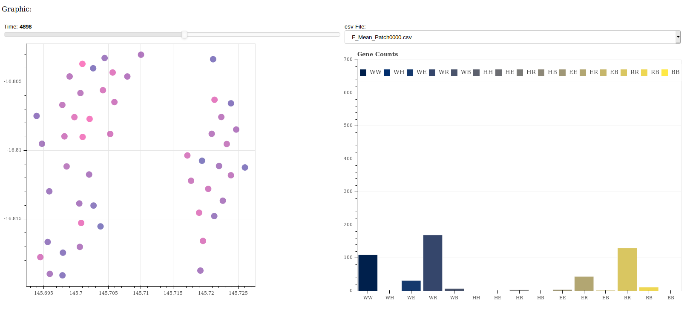

# MGGraph
 Sistema para el análisis de información de MGDrive

MGGraph es un sistema analítico enfocado en los resultados de los modelos predictivos de MGDrive. El sistema consiste en gráficas que cambian dinámicamente dependiendo de las herramientas que se usan.

La herramienta está desarrollada en Python, usando Django, Bokeh y Pandas como las librerías principales.

Las versiones que hay que contemplar para el funcionamiento de la herramienta son los siguientes:

| Herramienta | Versión |
| ----------- | ------- |
| Python      | 3.6.9   |
| Bokeh       | 1.3.4   |
| Django      | 2.2.6   |
| Pandas      | 0.25.3  |

Para utilizar la herramienta se necesita clonar el dispositivo y acceder al ambiente virtual de desarrollo (**mggraph_venv**):

`source mggraph_venv/bin/activate`

Una vez activado, se corre la aplicación de Django:

`python MGGraph/manage.py runserver`

