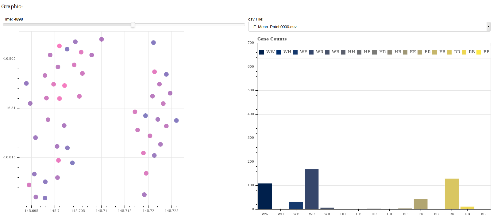
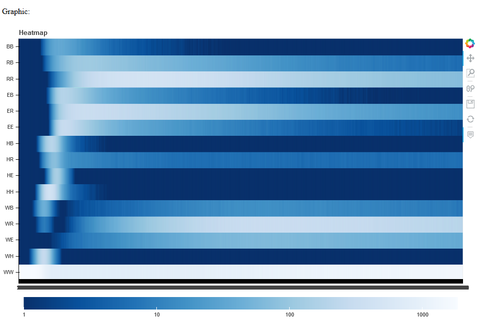
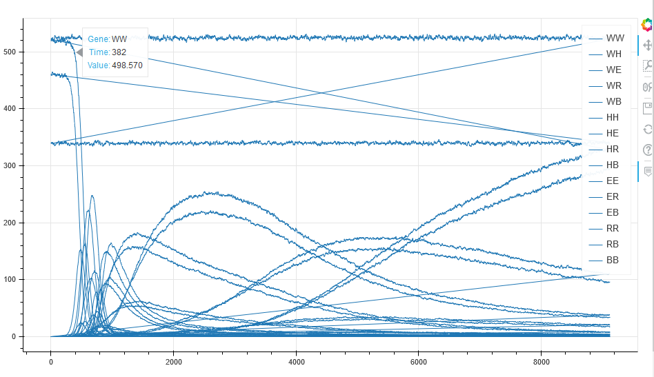
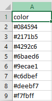

# MGGraph
 Sistema para el análisis de información de MGDrive


MGGraph es un sistema analítico enfocado en los resultados de los modelos predictivos de MGDrive. El sistema consiste en gráficas que cambian dinámicamente dependiendo de las herramientas utilizadas.




La herramienta está desarrollada en Python, usando Django, Bokeh y Pandas como las librerías principales.

Este desarrollo fue probado con Python versión 3.8.3. A continuación se listan las veriones de las librerías principales. La lista completa de dependencias y sus versiones se encuentra en el archivo `requirements.txt`.

| Herramienta | Versión |
| ----------- | ------- |
| Bokeh       | 2.0.2   |
| Django      | 3.0.6   |
| Pandas      | 1.0.3   |

## Instalación y dependencias
Para utilizar esta herramienta, clona el repositorio y navega hasta el directorio que contiene este archivo.

Con el objetivo de evitar conflictos con las versiones de dependencias de otros paquetes de Python instalados globalmente, se recomienda utilizar un ambiente virtual _(venv)_.

```bash
source mggraph_venv/bin/activate
```

Si se desea correr el proyecto en windows se debe de correr el siguiente comando:

```cmd
./env/Scrips/activate
```

Instala las dependencias con el siguiente comando:

```bash
pip install -r requirements.txt
```

## Ejecución

Teniendo activado el ambiente virtual, ejecuta la aplicación de Django con el siguiente comando:

```bash
python MGGraph/manage.py runserver
```

Y accede a la dirección http://localhost:8000/


# ¡Nuevo!
* Ahora los archivos que contenienen la información de los mosquitos pueden ser de formato .bmz (pickle).
* Se puede remover la columna "Total" de los datos a renderizar.

## Se agregaron dos nuevas visualizaciones a MGGraph:

* Heatmap



* Multiple lines graph



## Asignar colores
A la herramienta ahora se le puede pasar un .csv que cambiará los colores a renderizar de las gráficas.

Este .csv solo debe de tener una columna llamada "color".

Ejemplo:


