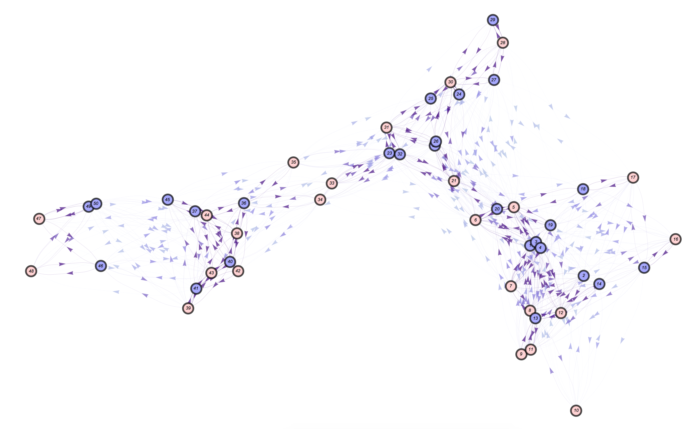

# **Mo**squito **Ne**tworks **T**askforce (MoNeT)

This repository was created to facilitate collaboration in network analysis routines useful for both *MGDrivE* and *MASH* projects (as some of the scripts required to perform this kind of studies can be used indistinctly by both frameworks).

## Contributors

<a href="https://sarafinasmith.github.io/">Sarafina Smith</a>, Sabrina Wong, Biyonka Liang, <a href="https://slwu89.github.io/">Sean L. Wu</a>, Daniel Citron, <a href="https://chipdelmal.github.io/">Héctor M. Sánchez C.</a>

## PI's

<a href="http://sph.berkeley.edu/john-marshall">John M. Marshall</a> and <a href="https://globalhealth.washington.edu/faculty/david-smith">David L. Smith</a>
