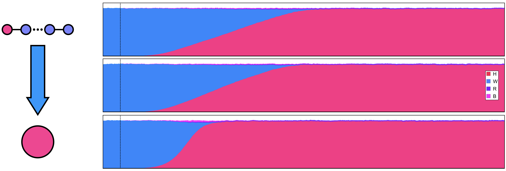
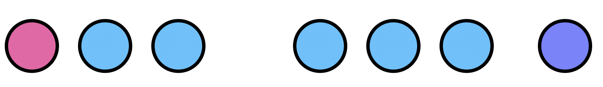

# Undergraduate Students Projects (UC, Berkeley)

These projects overlap our wider [landscape analysis](https://chipdelmal.github.io/MoNeT/Networks.html) and [data analysis](https://chipdelmal.github.io/MoNeT/DataAnalysis.html) workflows within [John Marshall's lab](https://www.marshalllab.com/), so in this page we present a brief summary of the goals of each of the projects. For more information, click on the title to go to the workflow page.


##  [Landscape Aggregation (Gillian Chu)](https://chipdelmal.github.io/MoNeT/LandscapeAggregation.html)


The idea in these sets of experiments is to understand the differences in dynamics of the spread of gene drives in spatiotemporal landscapes, and how these dynamics are affected when we increase the aggregation (clustering) level of the breeding sites.

<center></center>

## [Mosquito Habitats Spatial Heterogeneity (Biyonka Liang)](https://chipdelmal.github.io/MoNeT/SpatialDistribution.html)

The thorough study of spatial heterogeneity in mosquito habitats is still a missing piece in our understanding of the spread of gene drives for disease control applications. To tackle this problem, we will look into how an MCR construct spreads in landscapes with varying degrees of heterogeneity in their spatial distribution.

<center></center>


##  [Mosquito Population Size Heterogeneity (Maya Shen)](https://chipdelmal.github.io/MoNeT/PopSizeHeterogeneity.html)

Although widely thought as being important for gene-flow dynamics, the effects of heterogeneity in population sizes have rarely been studied in detail. In this work, we intend to go tackle this problem systematically so that we can understand how it might be of relevance in the study of new disease-control interventions such as gene-drives.

<center></center>

##  [Clustering of Directed Networks with Geographical Constraints (Biyonka Liang)](https://chipdelmal.github.io/MoNeT/Community.html)

The main idea for this workflow is to create an algorithm that combines the information of the geographical clustering of a pointset, along with the mosquito movement kernel. The advantage of doing this, would be that it would take into account the mosquito movement part of the dynamics of the disease transmission, while still making it aware that these dynamics are "anchored" to a geographic setting; giving us an informed way to aggregate geographic populations of mosquitos moving on the landscape.

<center></center>

##  [Gene-Drives Data Visualization Python Module (Sarafina Smith)](https://chipdelmal.github.io/MoNeT/DataVisualization.html)

Presenting the results of the data analysis routines in gene flows presents some interesting challenges. In particular, whilst developing and performing analyses for the [*MGDrivE*](https://marshalllab.github.io/MGDrivE/), we realized the need to come up with a toolbox to provide consistent and meaningful ways to visualize the results of our experiments.

<center></center>


##  [Gene-Drive Data Analysis Python Module (Sarafina Smith)](https://chipdelmal.github.io/MoNeT/PythonModule.html)

This module was created to accompany the [*MGDrivE*](https://marshalllab.github.io/MGDrivE/) project, although its codebase is totally independent to allow as much modularity as possible. This is not only convenient in terms of the code, but it also provides a clear-cut separation between designing and running experiments, and analyzing the results.


```Python
import MoNeT_MGDrivE as monet
# Define the experiment's path
type = float
experimentString = "E_090_050_010_025"
path = "/Users/sanchez.hmsc/Desktop/ParserDataset/"
```
