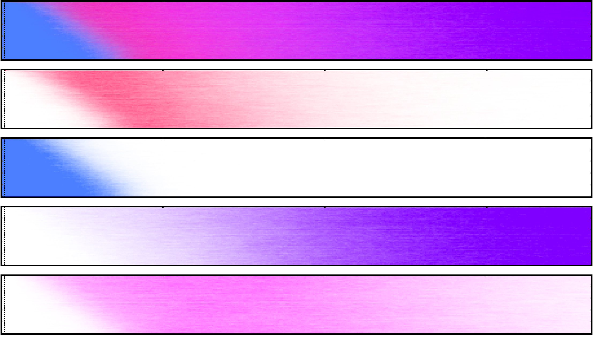

# Data Analysis

This is the activity in which we spend most of our time. Most of the data we generate in our simulations has strong spatio-temporal relationships, which makes the study of relationships difficult. On top of this, we usually analyze large number of genotypes and how they spread under the influence of large numbers of stochastic events. For this to be a more manageable task, we have divided our landscape analysis into modular components that we tackle independently. We also develop the software we need to streamline these analysis in a parallel workflow so that we can reproduce, and extend our results.

##  Habitat Heterogeneity Effects on the Spread of Gene Drives

Spatial heterogeneity is widely known to be important for the study of mosquito-borne diseases. However, it has rarely been studied in a systematic way. With the advent of gene-drive systems, the need for understanding of heterogeneity has become important due to the impact it could have in the prediction and confinability of these constructs in the field.

Our research group at University of California, Berkeley has developed a model to simulate spatiotemporal releases of mosquito gene-drives in arbitrary landscapes: [MGDrivE](https://marshalllab.github.io/MGDrivE/). In this framework we can run controlled experiments of realistic spread of genetic constructs so it makes sense for us to make use of it to simulate and analyze how the genetic modifications spread in landscapes with varying degrees of heterogeneity.

<!--(starting with the [MCR](http://science.sciencemag.org/content/348/6233/442))-->

To do so, we plan to take the following steps (click on the titles for more information):

### 0) Baseline landscape

We will start our analysis in a one-dimensional landscape. Across our experiments, we will use a line with **n** nodes in which each habitat will have a population size of: **p/n**. Where **p** is the total amount of male and female mosquitos in the environment. These nodes will be separated by a distance **d**, which needs to be calibrated according to the mosquito species under study (in this case, the *Aedes aegypti* mosquito).

### 1) [Spatial Distribution (Biyonka Liang)](./SpatialDistribution.html)

The first dimension of heterogeneity we will look into is the spatial distribution of mosquito breeding sites. To do this, we will randomly select **m** nodes in our baseline landscape, and shift them with a Gaussian probability kernel centered in the nodes' initial locations.

### 2) [Population Distribution (Maya Shen)](./PopSizeHeterogeneity.html)

The second dimension of variation we intend to study is the distribution of the population across breeding sites. Our initial systematic approach to doing it is to take the total population **p** and re distribute it randomly through the breeding sites.

### 3) [Levels of Aggregation (Gillian Chu)](./LandscapeAggregation.html)

Additionally, understanding the level of abstraction in the resolution of landscapes that can be tolerated for a particular analysis is extremely important. This is because we are ultimately constrained by computational resources, so we need to have a clear image of how much information is being lost when we aggregate breeding sites by mixing their populations to allow us the simulation of larger landscapes.

### 4) [Point-Type Heterogeneity (Yunewn Ji)](./PointType.html)

Another point of interest in these studies is how the availability of resources affects the way mosquitos move across the landscape. For this, we are setting up landscapes with heterogeneous pointsets to understand the impact of resources locations in mosquito flows.

<!-- ### 4) Factorial Combinations

Finally, once our routines have been tested independently, we will perform factorial combination experiments and data analysis to look for non-linear interactions of the heterogeneity components in an effort to enhance our understanding of these complex processes and to optimize our use of resources when performing gene-drive releases in the field.

 -->

##  [Gene-Drive Data Analysis and Visualization Python Module (Sarafina Smith)](https://chipdelmal.github.io/MoNeT/PythonModule.html)

This module was created to accompany the [*MGDrivE*](https://marshalllab.github.io/MGDrivE/) project, although its codebase is totally independent to allow as much modularity as possible. This is not only convenient in terms of the code, but it also provides a clear-cut separation between designing and running experiments, and analyzing the results.

<!--

## Other bits and pieces

### [Mosquito Sinks and Sources Detection](./SinkSource.html)

Mosquito-flow in the landscape is defined by the biological needs of the insects and the availability of resources (in a simple scenario). In certain situations, these variables might generate structures where mosquitos flows are highly directional between geographical clusters. This workflow was created to investigate which properties of the landscapes give birth to these kind of dynamics.

### [Targeted Interventions](./TargetedInterventions.html) and [Regular Grid Markov Analysis](./TheWalkingDead.html)

Identifying the most important points in landscapes in terms of mosquito-control interventions' effectiveness is far from a trivial task. These individuals move in probabilistic patterns according to their intrinsic biological needs, and environmental factors. To maximize the effect of the deployed measures to kill them, we need to take into account these variables, and this is what this workflow is all about.

### [Centrality Analysis of Landscapes](./Centrality.html)

The study of gene-drives' spread in realistic landscapes is of upmost importance when we think of using them to eradicate mosquito-borne diseases. Given that the insects' movements are the driving force behind these genes' spread, studying the flow of these individuals in geographic settings becomes crucial. In this workflow we borrow the centrality analysis of networks to understand the nodes that are more relevant in terms of these patterns, so that we can use this information to design studies that allow us to confine our constructs to designated areas.

##  [Mosquito Population Size Heterogeneity](https://chipdelmal.github.io/MoNeT/PopSizeHeterogeneity.html)

Although widely thought as being important for gene-flow dynamics, the effects of heterogeneity in population sizes have rarely been studied in detail. In this work, we intend to go tackle this problem systematically so that we can understand how it might be of relevance in the study of new disease-control interventions such as gene-drives.

### [Clustering of Directed Networks with Geographical Constraints](./Community.html)

Targeted vector control interventions are usually applied on the field without taking into account the movement of mosquitos across the landscape. This, however, might not be the most optimal way of trying to eradicate these insects. In this workflow, we try to create and test a clustering algorithm that takes into account both: mosquito movement, and geographical constraints; to understand the factors that would promote more efficient mosquito-control campaigns.

### [Households Distances Analysis](./HouseholdDistances.html)

The distance between households is thought to be an important metric in terms of the analysis of mosquito populations mixing and gene-drive flow. This is particularly true in the case of the _Aedes aegypti_ species, which is know for being a weak flyer that lives in close vicinity to human houses. This auxiliary workflow is aimed towards calculating the distances between the centroids of the households so that we can characterize the impact of these distances in terms of gene-flows.
-->

## Authors

* **Lead:** Héctor M. Sánchez C.
* **Dev/Research:** Gillian Chu, Maya Shen, Yunwen Ji,
* **Former Dev/Research:** Biyonka Liang, Sarafina Smith
* **PI:** John M. Marshall
