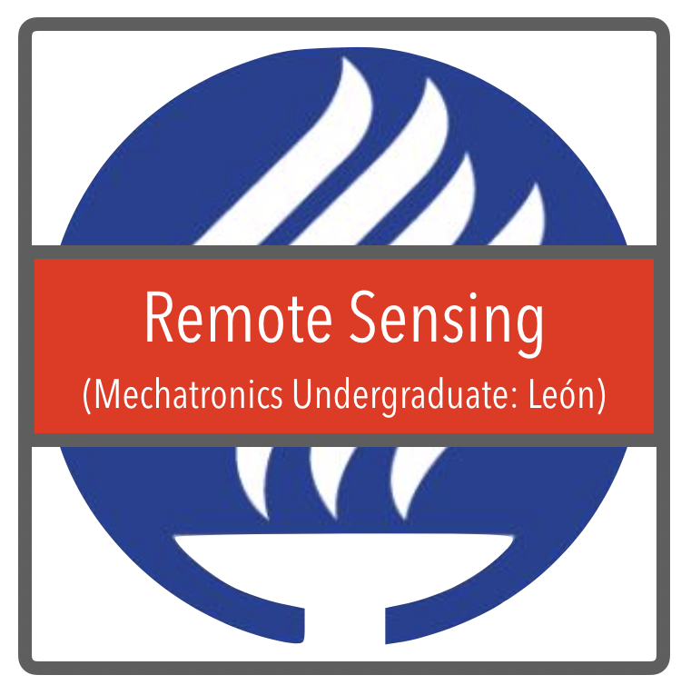

We are currently collaborating with faculty, and students from the "Tecnológico de Monterrey Institute" (México)  in the areas of knowledge (with application to mosquito borne diseases):

 

  
  <!---->

 

We welcome Berkeley undergrads who want to learn [CS/Stats/Data Analysis](./Berkeley.html) skills applied to mosquito gene-drive projects. We currently focus most of our work in data analysis/visualization using Python and network theory. Click on the button to learn more about current projects being developed by students.

In terms of [software development](./ITESM.html), we are working with Benjamín Valdés and András Takacs in the development of computer programs that help us gather, analyze and visualize data for our models. This collaboration is underway and has already resulted in projects being delivered (click on the image for more information).

<!--The [remote sensing](./EnvironmentalSensors.html) project is in the technical specification stage. We are starting a collaboration with Camilo Duque ("Mechatronics Engineering" program director in campus León) in determining the technical requirements for an autonomous sensing device to capture environmental data information relevant in the mosquito-borne diseases context.-->

For the [machine learning/network theory](./MachineLearning.html) projects we are collaborating with Edgar Vallejo (CS faculty in campus Estado de México) both in the development of techniques to predict the mosquito counts given environmental variables, and the prediction of Zika cases using weather data and Google Trends; as well as the prediction of impacts of mosquito control interventions in spatially explicit heterogeneous populations.

_Plese click on the images for more information about each project._

<a href="https://www.researchgate.net/profile/Benjamin_Valdes">Benjamín Valdés</a>, András Tackacs, <a href="https://www.researchgate.net/profile/Edgar_Vallejo">Edgar E. Vallejo</a>, <a href="http://sph.berkeley.edu/john-marshall">John M. Marshall</a>, <a href="https://chipdelmal.github.io/">Héctor M. Sánchez C.</a>
