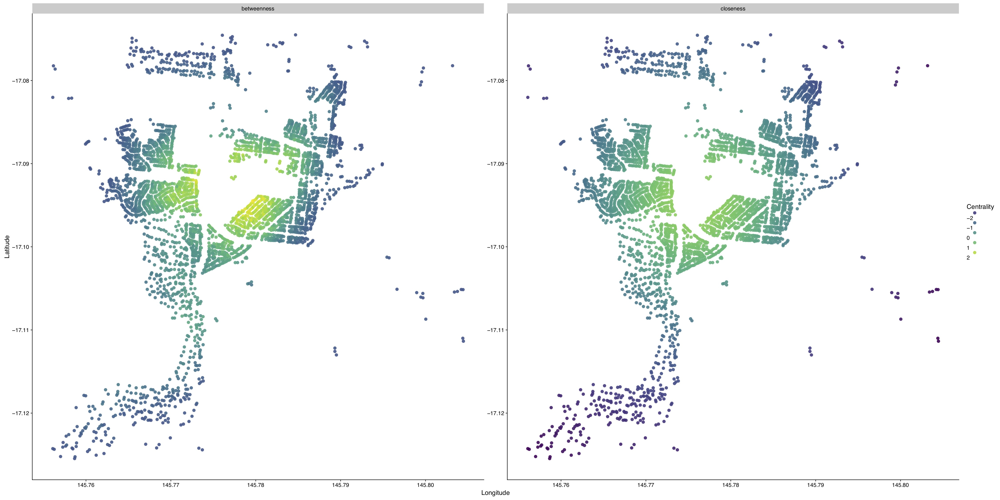
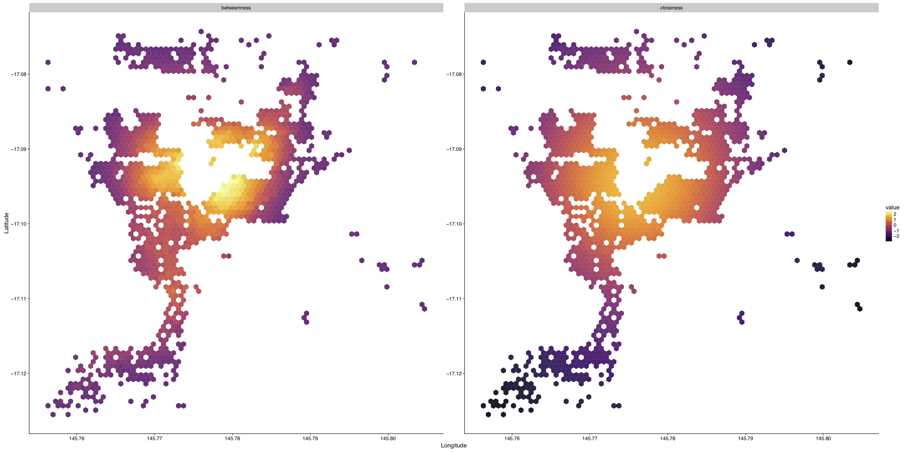

## Centrality Measures

Identifying the most important nodes in our landscape in terms of mosquito movement is a crucial task. Network theory provides with a set of tools that have been used in the past to analyze flow of information/matter (water, electricity, messages, traffic, etcetera), and obtain the sections of the movement matrix that are crucial in terms of mosquito movement (hubs and bridges).

### Workflow Description

This workflow is highly experimental as of now, and, as such, we are still looking into how we can obtain the most information our of our system in terms of spatial mosquito movement. For now, one of our main ideas is described in the following paragraphs.

#### "Bridging" Nodes

Our first attempt to analyze these mosquito movement patterns was to calculate the centrality of the whole landscape. Albeit useful, this only gives us a general image on the expected mosquitoes distribution and the importance of the nodes. By using the betweenness centrality metric on landscapes that contain defined, or semi-defined clusters, we are able to detect the nodes which act as bridges between communities. These nodes would be relevant in terms of understanding how two geographically close communities of points could be connected through mosquito movement.

#### Hierarchical Clustering and Iterative Centrality Calculation for Hubs Detection

Some centrality measures work by internaly generating a hierarchical agglomeration of points. It would be interesting to apply the clustering to each of the levels of hierarchy because it would give us different levels of granularity in terms of importance of the nodes as a function of the connection of communities.

#### Next Steps

This idea of hierarchical clustering and iterative centrality calculations should also link in with the analysis of the mosquito movement as [markov processes](./TargetedInterventions.html). This is because we could cluster the pointsets at different levels of aggregation, and then run random walkers on the different levels of aggregation. Once we do that, we could compare the results on an entomological/epidemiological metric that is relevant in terms of spatial resolution.

### Authors

Héctor M. Sánchez C., Sabrina Wong, Sarafina Smith, John M. Marshall, David L. Smith
