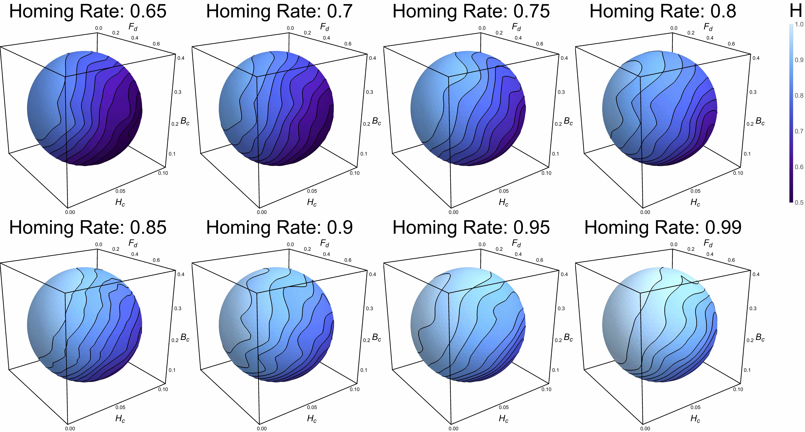

# Data Analysis Tools

## [Gene Drives Visualizations Tools](./DataVisualization.html)

The [*MGDrivE*](https://marshalllab.github.io/MGDrivE/) project has presented interesting challenges in terms of data analysis and visualization. By using _Mathematica_ and _Python_ we have been compiling a toolkit of plots and routines that allow us to analyse and describe the way genes disperse in the enviornment as a consequence of mosquito movement.

