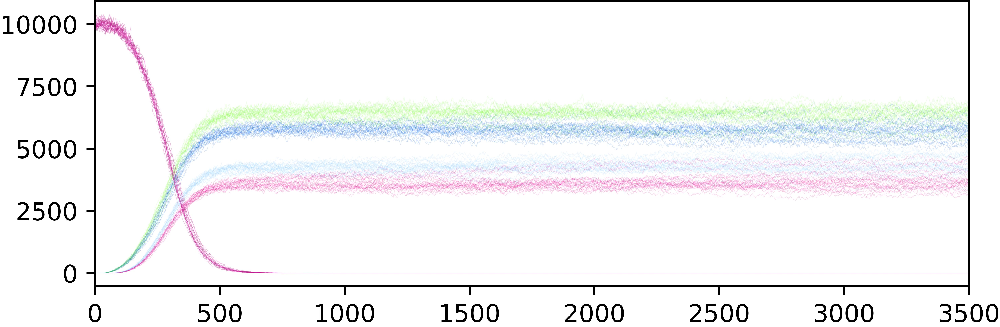

# Gene Drives Data Visualization

Presenting the results of the data analysis routines in gene flows presents some interesting challenges. In particular, whilst developing and performing analyses for the [*MGDrivE*](https://marshalllab.github.io/MGDrivE/), we realized the need to come up with a toolbox to provide consistent and meaningful ways to visualize the results of our experiments.

## Gene Proportion Traces

In a single population environment, the main challenge comes from presenting the results of stochastic iterations of experiments. For this purpose, we are creating "Traces Plots" in which we present alleles counts in different colors.

In the following examples we show the dynamics of a CRISPR system, and a "split-drive":

We provide both: _Mathematica_ and _Python_ implementations. In the following examples we show two versions generated through the _Python_ version being developed as a user-friendly way to analyze the datasets created in [*MGDrivE*](https://marshalllab.github.io/MGDrivE/):

   

## Gene Spatial Flows

Single populations are still reasonably described by a trace plot, but when we move towards visualizing the spatial spread of genes across different populations in a "network", this is no longer a viable option. The most natural way to show these results is in videos such as the following one:

  <iframe width="560" height="315" src="https://www.youtube.com/embed/PPvzeV_Gylk" frameborder="0" allow="accelerometer; autoplay; encrypted-media; gyroscope; picture-in-picture" allowfullscreen></iframe>

Although this makes for a nice way to present the idea in live demonstrations, for publications we need to show the dynamics in a "static" image. For this purpose, we have created the "flow plots". In these representations, each plot shows the spread of one of the alleles in the populations (y-axes), through time (x-axes):

With the top plot being the aggregate of all the alleles in the landscape. The stream plot version of the sum of the nodes populations into a single pool would be:

## More Information

For more information, take look at our [MoNeT python module](https://chipdelmal.github.io/MoNeT/PythonModule.html) and our [MGDrivE project](https://marshalllab.github.io/MGDrivE/)!

## Authors

Sarafina Smith, Víctor Ferman, Héctor M. Sánchez C.
