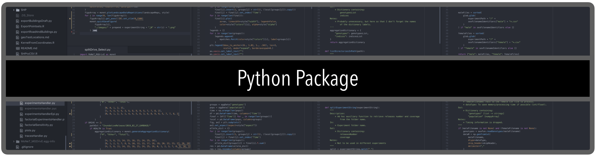
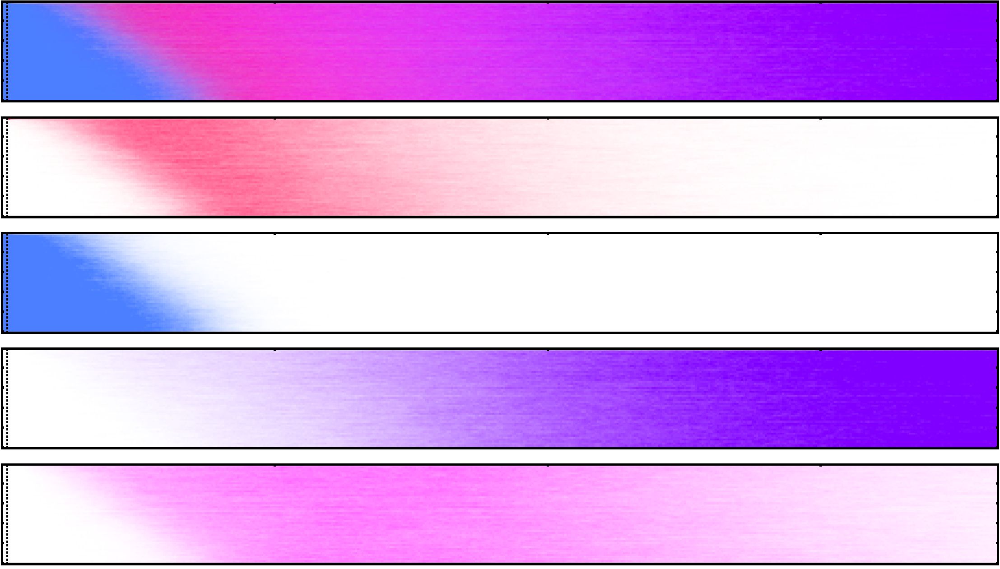

# Data Visualization

One of our most innovative and dynamic lines of research! We spend a lot of time working and thing on ways to display our information and analyses effectively and in an attractive way. Have a look at our [youtube playlist](https://www.youtube.com/playlist?list=PLRzY6w7pvIWqFJi94ZfhPkSVnazlUylpN) for some examples of our work.

<iframe width="560" height="315" src="https://www.youtube.com/embed/videoseries?list=PLRzY6w7pvIWqFJi94ZfhPkSVnazlUylpN" frameborder="0" allow="accelerometer; autoplay; encrypted-media; gyroscope; picture-in-picture" allowfullscreen></iframe>

## [MoNeT-MGDrivE](https://pypi.org/project/MoNeT-MGDrivE/) DataViz

Take a look at our [Python package](https://pypi.org/project/MoNeT-MGDrivE/)! This code works as a companion to the [*MGDrivE*](https://marshalllab.github.io/MGDrivE/) project in terms of data and experiments analyses.

  

<a href="https://chipdelmal.github.io/">Héctor M. Sánchez C.</a>
