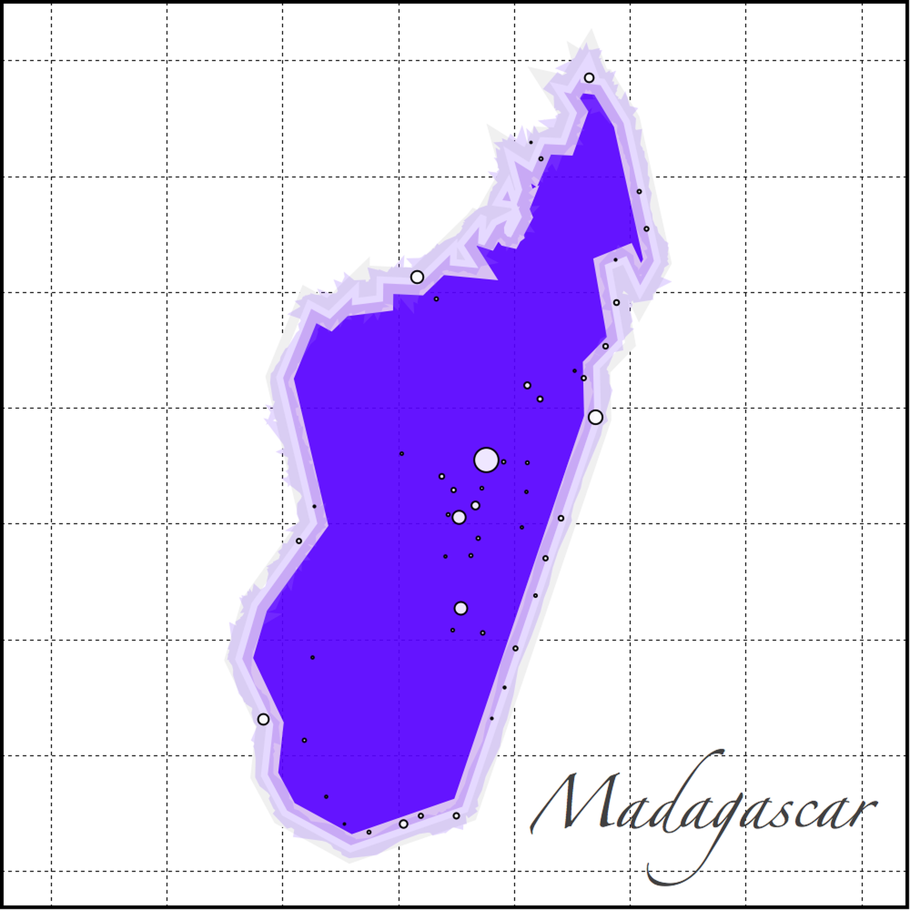
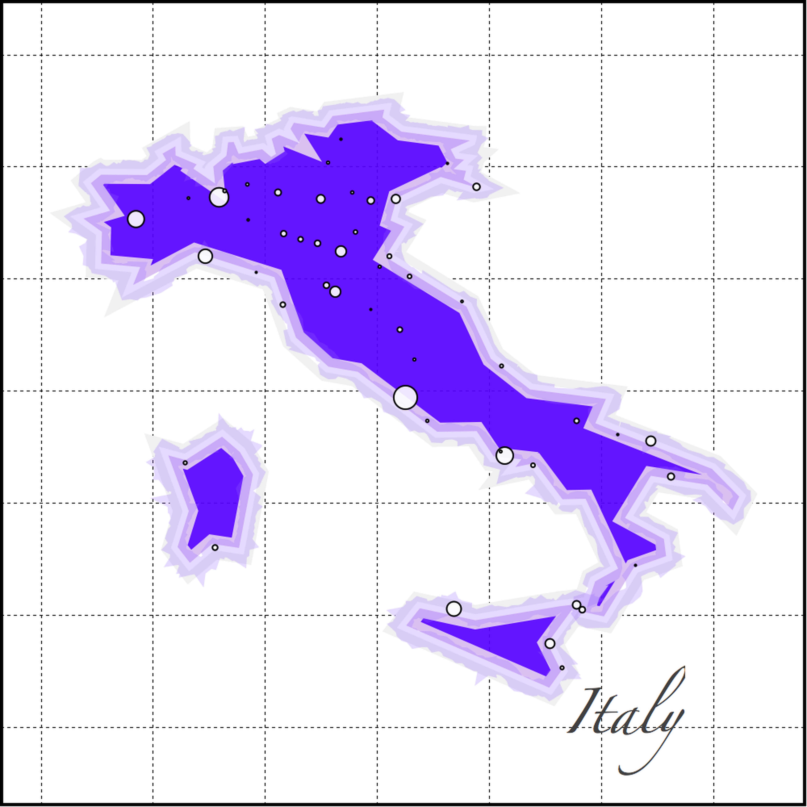
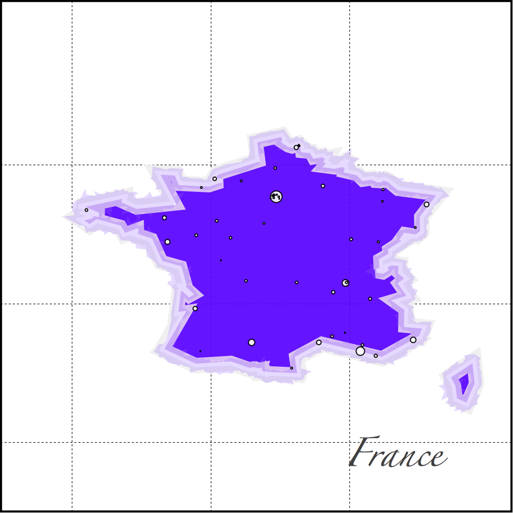

# Fancy Maps Parser

As its name suggests, this [routine](https://github.com/Chipdelmal/MoNeT/tree/master/FancyModernMaps) was created to parse city coordinates and population sizes; and create a map from them. It works with _Wolfram database_ and needs internet connection to load the country information. In addition to that, the routine exports the information into the appropriate [_OSMnx_](https://github.com/Chipdelmal/MoNeT/tree/master/OSMnx) folders in the _MoNeT_ project repository.

## Authors

Héctor M. Sánchez C.
