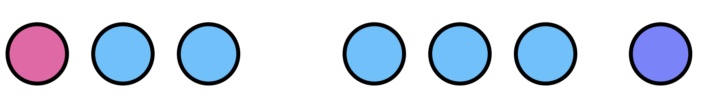

##  Habitat Heterogeneity Effects on the Spread of Gene Drives

Spatial heterogeneity is widely known to be important for the study of mosquito-borne diseases. However, it has rarely been studied in a systematic way. With the advent of gene-drive systems, the need for understanding of heterogeneity has become important due to the impact it could have in the prediction and confinability of these constructs in the field.

Our research group at University of California, Berkeley has developed a model to simulate spatiotemporal releases of mosquito gene-drives in arbitrary landscapes: [MGDrivE](https://marshalllab.github.io/MGDrivE/). In this framework we can run controlled experiments of realistic spread of genetic constructs so it makes sense for us to make use of it to simulate and analyze how the genetic modifications spread in landscapes with varying degrees of heterogeneity.

<!--(starting with the [MCR](http://science.sciencemag.org/content/348/6233/442))-->

To do so, we plan to take the following steps (click on the titles for more information):

### 0) Baseline landscape

We will start our analysis in a one-dimensional landscape. Across our experiments, we will use a line with **n** nodes in which each habitat will have a population size of: **p/n**. Where **p** is the total amount of male and female mosquitos in the environment. These nodes will be separated by a distance **d**, which needs to be calibrated according to the mosquito species under study (in this case, the *Aedes aegypti* mosquito).

### 1) [Spatial Distribution](./SpatialDistribution.html) <!--(Biyonka Liang)-->

The first dimension of heterogeneity we will look into is the spatial distribution of mosquito breeding sites. To do this, we will randomly select **m** nodes in our baseline landscape, and shift them

### 2) [Population Distribution](./PopSizeHeterogeneity.html) <!--(Maya Shen)-->

### 3) [Levels of Aggregation](./LandscapeAggregation.html) <!--(Gillian Chu)-->

### 4) Factorial Combinations <!-- (Sarafina Smith)-->

Finally, once our routines have been tested independently, we will perform factorial combination experiments and data analysis to look for non-linear interactions of the heterogeneity components in an effort to understand and simplify our

### Authors

**Lead:** Héctor M. Sánchez C.
**Dev/Research:** Gillian Chu, Biyonka Liang, Maya Shen, Sarafina Smith, Héctor M. Sánchez C.
**PI:** John M. Marshall
