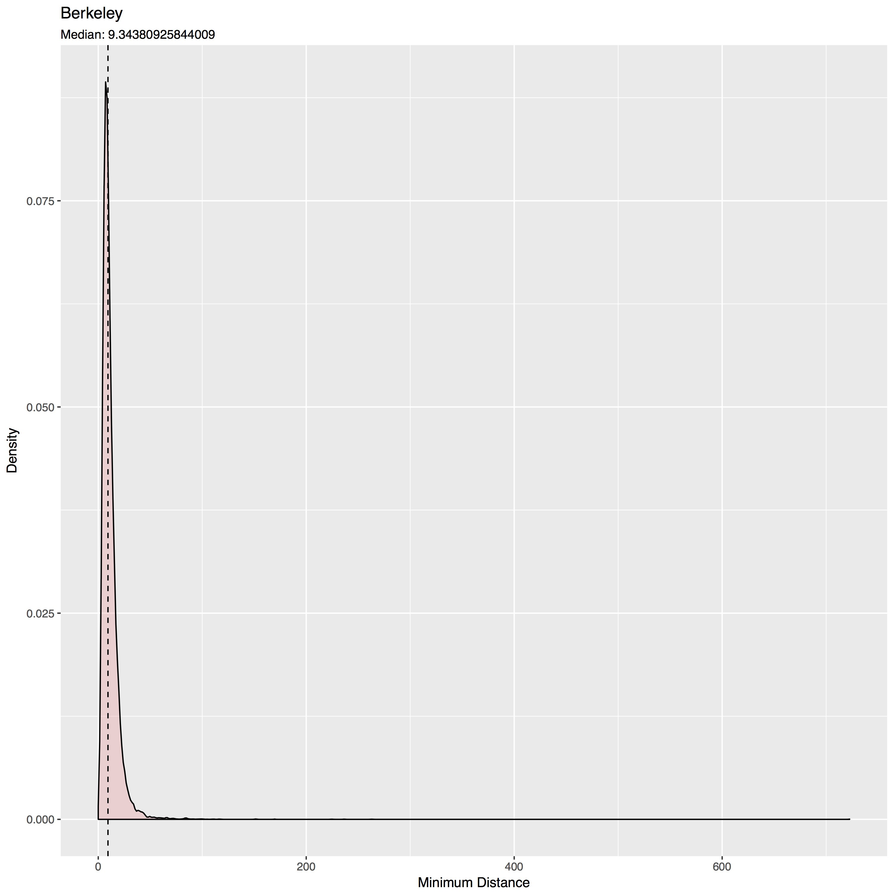
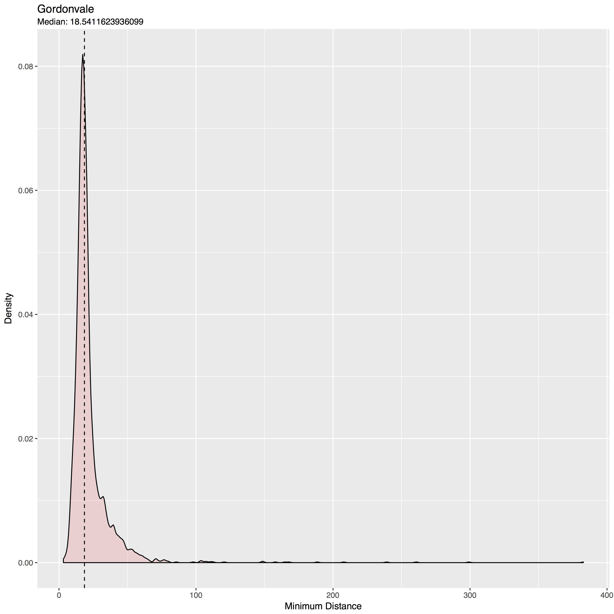
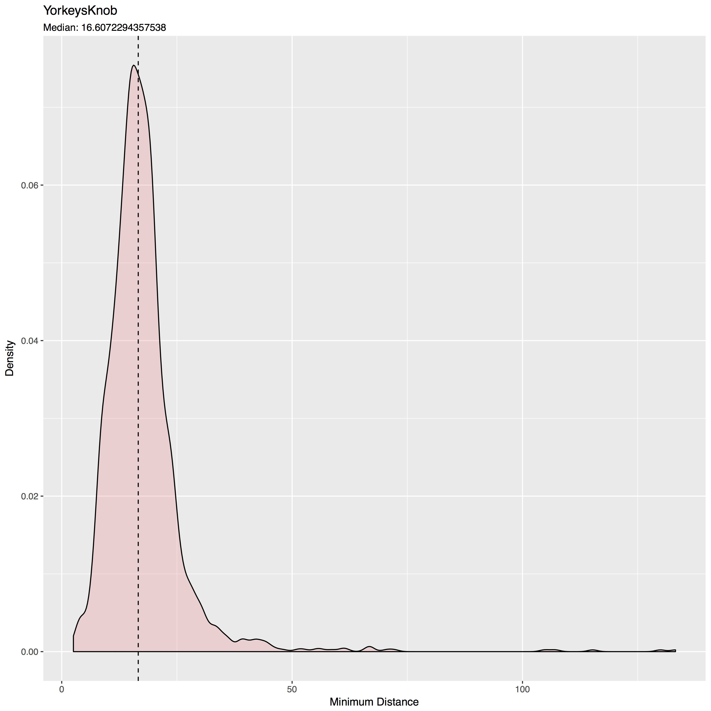

## Inter-Households Distances Analysis

As mentioned before, the distance between households is an important metric in terms of gene-flow of drives designed for the _Aedes aegypti_ mosquito. The scripts developed for this workflow should help us understand the effects of households distances in the flow of gene-drives in spatial layouts.

### Minimum Distances Between Households Centroids

The most basic metric to get this analysis started was to obtain the centroids of the polygons of the buildings parsed by our [OSMnx script](./OSMnx.html) and calculate the distance to the closest house in the vicinity. This has allowed us to calibrate randomly generated landscapes to be consistent with realistic landscapes. The script has also allowed us to compare different settings such as densely populated areas such as Berkeley, Californa; against Gordonvale, and Yorkeys Knob, Australia (where _Wolbachia_ test releases have taken place in the past).

### Authors

Héctor M. Sánchez C., John M. Marshall
