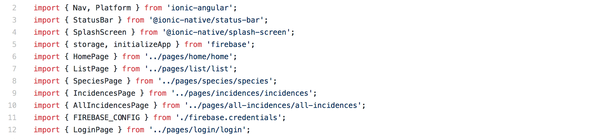

# Undergraduate Students Projects (UC, Berkeley - Tecnológico de Monterrey Collaborations)

This workflow was created to facilitate the creation of tools to be used as part of the [*MGDrivE*](https://marshalllab.github.io/MGDrivE/) project. It represents the collaboration between UC, Berkeley and Tecnológico de Monterrey in an effort to get undergraduate students involved in mosquito-borne diseases research projects. One of such projects is the  [Mosquito App](./MosquitoApp.html) (follow the link for more information).

## 1) Crowd sourcing tool for gathering data on mosquitoes _(AT, HMSC)_

Generate a tool that allows people (civilians or health services workers) to report information of mosquito presence, species, pictures?

_Related areas of interest: Web Development, Data Science, Crowd Sourcing algorithms and architectures, among others._

**Delivered Projects**:

* Martín Alejandro Molinero Morales:	Identificacion y prevención de epidemias a partir del registro de presencia de mosquitos por medio de una aplicacion web

  <button>[Github Repository](https://github.com/MartinMolinero/mosquito-app-backend)</button><button>[YouTube Video](https://www.youtube.com/watch?v=fajQVGXrmIo)</button>
   
* Christian Ricardo Solís Cortés:	Herramienta de crowdsourcing para recopilar datos sobre la presencia de mosquitos.

  <button>[Github Repository](https://github.com/crsc26/Crowd-sourcing-mosquito-tool)</button>

## 2) Markov Chain Models for mosquito migration

From a mosquito migration matrix (which is given) calculate the distribution of mosquitoes across the given landscape, and compile metrics on the importance of the sites in terms of mosquito quantities and flows. The project should be built as a script in the R or Python language.

_Related areas of interest: Statistical Programming, Markov chains models, Network Theory._

## 3) Real time graphics generator of mosquito migration

Currently the system generates several .csv files that contain the population of each node across the time steps of each node. The simulator (which is coded on the R programming platform, and available in an open github repository), needs a way of visualizing the data on the spread of the gene-drives in real time. Examples of the desired animations can be found at the project's <a href="https://www.youtube.com/playlist?list=PLRzY6w7pvIWqFJi94ZfhPkSVnazlUylpN">youtube playlist</a>.

_Related areas of interest: Graphics, Data Visualization, Data Analysis, Statistical Programming, R language._

## 4) Standalone animation generator _(AT, HMSC)_

Currently the system generates several .csv files that contain the population of each node across the time steps of each node. Check the output ADM and AFs .csv files generated. Lab members are interested in animated visualizations of simulation, however current animations are created by hand and take several hours to make, an example of such animations can be found in the project's <a href="https://www.youtube.com/playlist?list=PLRzY6w7pvIWqFJi94ZfhPkSVnazlUylpN">youtube playlist</a>. A tool is needed to parse the .csv files and generate useful visualizations and animations of the simulation in an automatic and efficient way. The difference between the previous project and this ones is that this is expected to be a standalone a tool with more interesting visualizations.

_Related areas of interest: Graphics, Animation, Data Visualization, Data Analysis._

**Delivered Projects**:

* Salomón Olivera Abud:	Software generador de representaciones graficas de datos obtenidos a traves de MGDrivE
  <button>[Github Repository](https://github.com/Salomon21/MGDrivE_Graph_Tool)</button> <button>[YouTube Video](https://www.youtube.com/watch?v=_Ex5RUrOaxw)</button>
 
* Esteban Quintana Cueto:	Herramienta para la visualizacion gráfica de reproducción y comportamiento de distintas especies de mosquitos
<button>[Github repository](https://github.com/estebanquintana6/Tesina_MGraph)</button> <button>[YouTube Video](https://www.youtube.com/watch?v=f0VMLtwOxmk&feature=youtu.be)</button>

## 5) Random scenarios generator

Create a random scenario generator (graph/network generator), where cities or graphs of populations are randomly generated. The scenario generator should be parametrized, i.e. (max and minimum distances between nodes, number of nodes, distribution or sparsity configuration, etc.). The Generated environments should contemplate several thousands of nodes, and decisions as to how to generate the random numbers should be backed up and validated for scale numbers.

_Related areas of interest: Random Number Theory, Data Generation, Network Theory, Statistics._

## 6) Road-flight path intersections

Aedes aegypti mosquitoes avoid flying over roads; which, in turn, modifies the expected movement flows on the landscape. We would like to study how this specific variable affects the broad-scale dynamics of mosquito movement to understand the effects this would have in diseases transmission. It would be convenient to integrate the current simulation model with open street maps  <a href="https://www.openstreetmap.org">OpenStreetMap</a> or a similar mapping application, to detect the number of roads(or obstacles) crossed by the connection between 2 nodes(patches) in the graph.
The graph is modeled with an adjacency matrix that models the probability of a mosquito moving between two nodes. This matrix is already provided and calculated elsewhere.  The project should be able to map the provided graph from the MGDrivE system to a geographical model (openstreetmaps) and register the number car roads that intersect with the line between two nodes(mosquito flight path); to generate a matrix where the number of intersections of humans roads per mosquito flight paths are stored.

_Related areas of interest: App Integration, Web Development, Data Visualization._

## 7) Water bodies detection _(BV, HMSC)_

Detecting water sources in the landscape is important because of the information it provides about mosquito distribution. Collecting data, however, is not easy. In this project, we aim to use available satellite information such as the one provided by Google Maps, to segment, and detect water bodies using machine learning algorithms.

_Related areas of interest: GIS, Machine Learning_

**Ongoing Projects**:

* Moisés Montaño Copca:	Water bodies detection with satellite image processing using TensorFlow

## Collaborators

<a href="https://www.researchgate.net/profile/Benjamin_Valdes">Benjamín Valdés</a> (BV), András Tackacs (AT), <a href="https://chipdelmal.github.io/">Héctor M. Sánchez C.</a> (HMSC)

