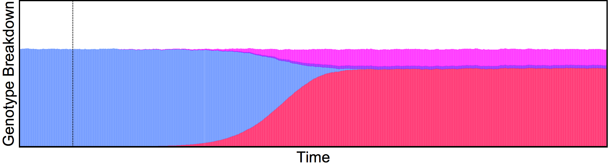

<script src="https://cdnjs.cloudflare.com/ajax/libs/mathjax/2.7.0/MathJax.js?config=TeX-AMS-MML_HTMLorMML" type="text/javascript"></script>

## Landscape Aggregation

The idea in these sets of experiments is to understand the differences in dynamics of the spread of gene drives in spatiotemporal landscapes, and how these dynamics are affected when we increase the aggregation (clustering) level of the breeding sites.

### Steps & Methodology

The main goal is to determine a metric of information loss that we can use in the specific context of gene flows in mosquito populations.

#### Initial Exploratory Experiment

For this experiment, we are defining equally-sized mosquito populations to lie in a line, at a uniform distance from each other. With this basic spatial setting, we cluster hierarchically the populations: starting from having each node in it's own "cluster", and going up to all the points belonging to the same cluster group.

<center>
  
  <figcaption style="font-size:10px">Two different levels of aggregation in the clustering.</figcaption>
</center>
<br>

In doing so, we increase the population size to keep that variable constant across scenarios.

After generating different levels of aggregation, we run a gene drive construct. In this case, we are using MCR with different configurations $[H_{fitness},B_{fitness},F_{deposition}]$ to test various fixation speeds.

After running [*MGDrivE*](https://marshalllab.github.io/MGDrivE/), we display de results of the simulation runs to look at the qualitative differences in the systems' responses.


<figure>
  
  <figcaption style="font-size:10px">Fully aggregated landscape.</figcaption>
</figure>


<figure>
  
  <figcaption style="font-size:10px">No aggregation landscape.</figcaption>
</figure>


#### Next Steps

Provided that there are noticeable differences between the predictions on the initial exploratory experiment, we can start looking at the following tasks:

- Sweeping through the aggregation levels and simulating homing drives upon them
- Finding/coding a more efficient clustering algorithm
- Looking for an information metric that provides useful information
- Extending to grids
- Extending to irregular landscapes


### Authors

Gillian Chu, Héctor M. Sánchez C.


<!--
1. Code a routine that takes a number of nodes to place in a line at a given distance
```cpp
placeOnLine(nodesNumber=n,distanceBetweenNodes=x){
  ...
  return xyCoordinates
}
```

2. Code a draft of the hierarchical aggregation routine. The routine should be able to take x,y coordinates and perform the aggregation at different levels of resolution. The return
```cpp
hierarchicalAggregation(nodes=xyCoordinates,resolution=aggregationResolution,populationSizes=sizesLists){
  ...
  return clusteredCoordinatesCentroids
}
```

3. Define a routine to run MCR gene drives (based on the current MCR factorial experiments)
```cpp
runMCR(landscape=aggregatedLandscape,geneDrive=MCR){
  return populationDynamics
}
```

4. Run an experiment at the lowest, and highest resolutions. The experiment should be a low-release size with a large number of nodes.

5. Compare the system in terms of population dynamics differences. -->
