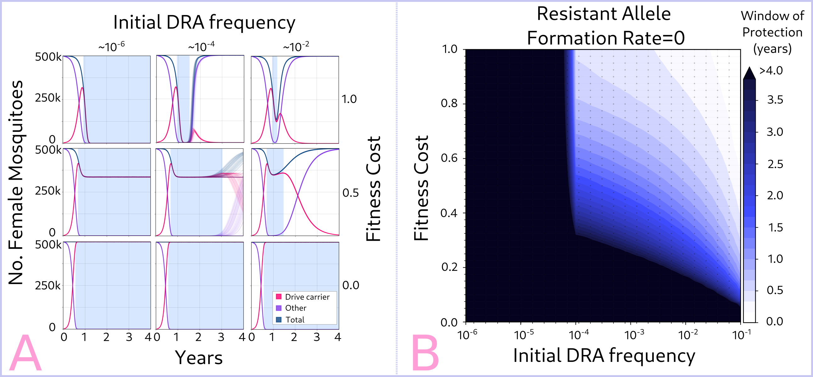
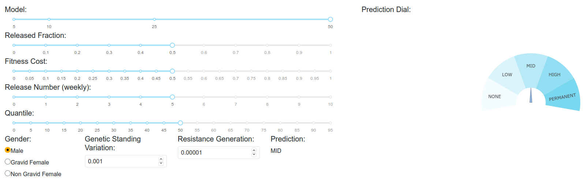

# Machine Learning Datasets Explorer

As our gene drive simulations become more complex in terms of parameters, the response space grows accordingly. This creates problems in terms of understanding the effects of each input upon the outcome of the simulation, and sharing with collaborators.

Over time, we've developed several summary statistics or metrics to gauge the success of a wide array of gene drive constructs. One of these metrics is the "window of protection", which we define as the period of time in which the number of potential disease carrying mosquitoes stay below a given threshold of the population (usually, below 10% of the total).

 

Given that we already generate large datasets for our gene drive modelling experiments, we thought it'd be a natural extension to use them to create predicting models that allowed the exploration of parameters combinations.

## Authors

Christopher De Leon, Guillermo O. Cota M., Ana L. Dueñas C., Juán J. Olivera L., Héctor M. Sánchez C.