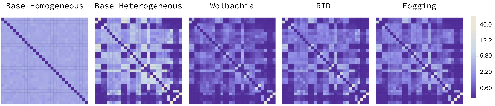
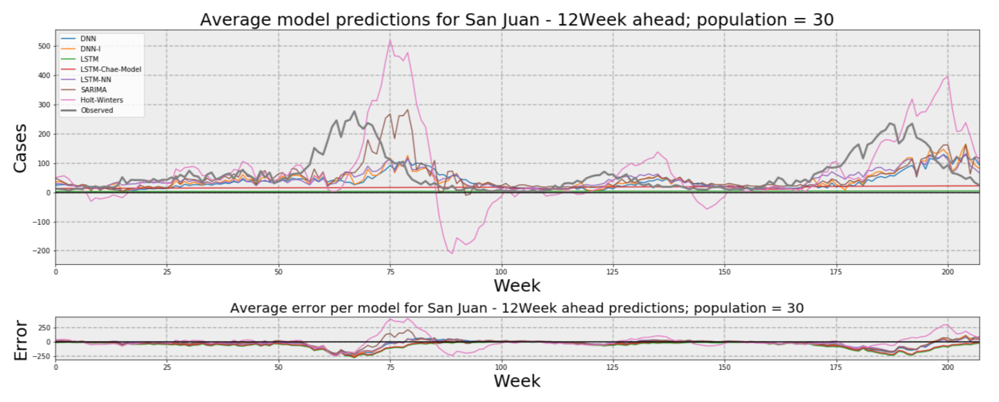
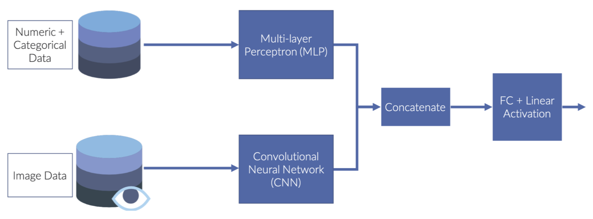

# Machine Learning and Network Theory

These projects focus on the use of techniques that are more traditionally used in computer science in mosquio-borne diseases contexts.

<!-- Héctor -->
## PhD Thesis

**SoNA3BS: An Agent-Based Model to Study High-Resolution Spatial Heterogeneity in Aedes aegypti-Borne Diseases Through the Use of Network Theory.** *Héctor M. Sánchez C., John M. Marshall, Edgar E. Vallejo*

In this thesis work, we explored the usefulness of the combination of agent-based modelling with network theory analysis to understand the fine-scale details of mosquito borne diseases transmission in heterogeneous environments. We used graph theory to compare three mosquito control interventions and to show how these ideas can be extended to a larger analysis framework. For more information please read the [thesis publication]().

 This project was funded by <a href="https://www.conacyt.gob.mx/">CONACyT</a>, <a href="https://ucmexus.ucr.edu/">UC-Mexus</a>, and <a href="https://research.google/outreach/latin-america-research-awards/">Google Research Awards: Latin America</a>.

<!-- Kevin -->
## Masters Thesis

<a href="https://www.researchgate.net/publication/333176157_A_Novel_Deep_Recurrent_Neural_Network_Architecture_for_Time_Series_Forecasting_of_Mosquito-Borne_Disease_Case_Counts">A Novel Deep Recurrent Neural Network Architecture for Time Series Forecasting of Mosquito-Borne Disease Case Counts</a> *Kevin Islas Abud, Héctor M. Sánchez C., Edgar E. Vallejo*

Mosquito-borne diseases account for over 1 million deaths yearly. Most of these diseases (dengue, chikungunya, yellow-fever, Zika) are transmitted by the Aedes aegypti mosquito. Recent changes in demographics have resulted in the rise of yearly cases of these diseases over the last decades. Amongst these diseases dengue has been the disease with the greatest increase, having a 30-fold increase in yearly cases over the last decades. With no vaccine available for most mosquito-borne diseases, the main method of minimizing the risk of an epidemic has been through the use of vector control strategies which focus in reducing mosquito populations. However, due to delays in effectively identifying an outbreak during its early stages, the efforts for diminishing epidemics has sometimes failed. Such as the case of the Zika epidemic in Latin America during 2015, which was mainly attributed to a delayed response. As a result of that, in recent years there has been an increasing interest in developing predictive models for mosquito-borne disease incidence. With much effort being put towards the use of deep recurrent neural networks since they have shown to outperform statistical models in accuracy for such forecasts. Throughout this thesis document we will propose a novel architecture for developing deep recurrent neural networks (DRNN) which extends upon ideas from convolutional neural networks (CNN) that allow independent activations of separate layers to enhance a model’s performance. We will compare the proposed model with various state of the art statistical and deep learning models in order to assess its performance for predicting dengue and Zika case incidence. Throughout these experiments we will determine the cases in which our model outperforms the competing models. Throughout these experiments we expect to show how the field of Epidemiology can benefit from using the hybrid architecture model that we propose as well as how to address common problems in disease forecasting, such as missing data and the use of internet search queries as a predictor. Furthermore, in this document we explore the use of hybrid architectures in deep recurrent neural networks for time series forecasting, to the best of our knowledge, these ideas have not been explored in previous literature. By doing so, we expect to extend our current understanding on the use of this type of deep learning models for time series forecasting.

 This project was funded by  <a href="https://www.conacyt.gob.mx/">CONACyT</a>, and <a href="https://research.google/outreach/latin-america-research-awards/">Google Research Awards: Latin America</a>.

<!-- Rodrigo -->
## Masters Thesis

<a href="https://www.researchgate.net/publication/337744991_Application_of_a_hybrid_neural_network_trained_with_satellite_imagery_and_weather_data_to_predict_mosquito_populations_based_on_mosquito_trap_captures?_sg=3YowtNMxUmwmxWyUkgx1F8XA7kXLJCq1_st75zjsqbb4U4FdOrGjAzxvznJI6CyVJaJV9QAgNWkwAxK32OmfWRaGvS1FqzlVRi5HBtu5.UNv8bV6iPBDGpOpv4D7F5GoTuzAnicycd_9VBDn1d3m0SacmYkAid2bq4Q-rLlP2hAlp87MzejKNJllJFIjXTg">Application of a hybrid neural network trained with satellite imagery and weather data to predict mosquito populations based on mosquito trap captures</a> *Luis Rodrigo Careaga Sotomayor, Edgar E. Vallejo, Héctor M. Sánchez C.*

Mosquitoes are the deadliest animals on the planet causing more than one million human deaths every year. Having estimates of vector population can help focus resources in a given time and space due to constraints. This work objective is to describe the process of designing and developing a model to predict mosquito populations based on satellite images and weather variables. The driving idea behind this work purpose is to combine a Multi-Layer Perceptron (MLP) concatenated with a Convolutional Neural Network (CNN) and compare it to state- of-the-art models. We perform experiments using publicly available satellite images from Google Maps and mosquitoes databases from the VectorBase project. We applied various machine learning models, and algorithms such as SVM & random forests to compare with our model. The hybrid model proved to be successful and was able to perform better than the MLP and CNN used separately.

 

_This project was funded by <a href="https://citris-uc.org/">CITRIS</a>_, and  <a href="https://www.conacyt.gob.mx/">CONACyT</a>

## Collaborators

 <a href="https://chipdelmal.github.io/">Héctor M. Sánchez C.</a>, <a href="https://www.researchgate.net/profile/Edgar_Vallejo">Edgar E. Vallejo</a>, <a href="http://sph.berkeley.edu/john-marshall">John M. Marshall</a>
