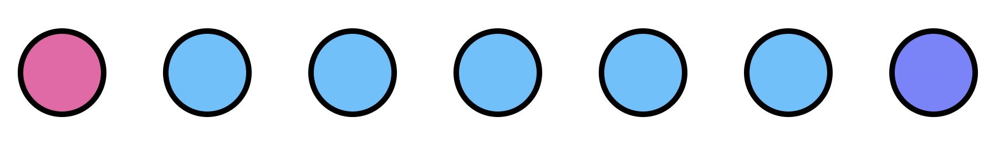
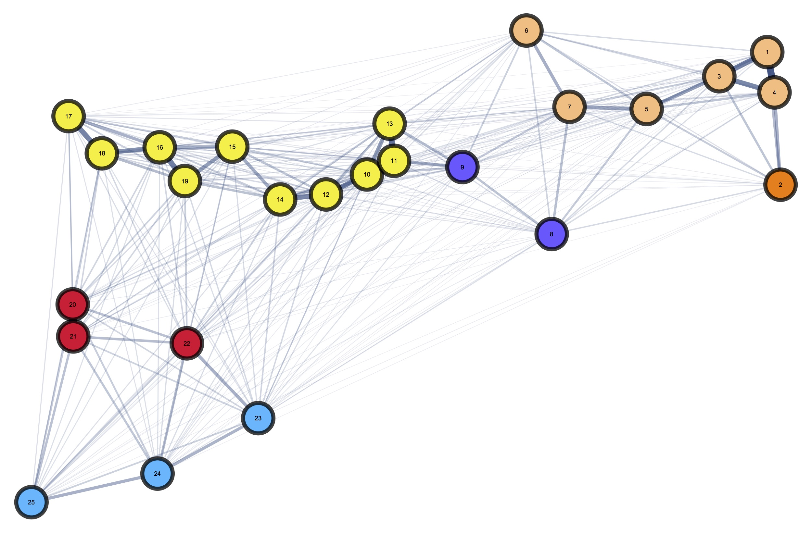

# Landscape Analysis

This was once _MoNeT_'s raison d'être. The objective of these tasks and workflows is to further our understanding of the impact of the spatial distribution of resources upon the dynamics of the spread of genes and diseases transmitted by mosquitos.

## [Gene-Drives Landscape Heterogeneity](https://chipdelmal.github.io/MoNeT/GMSpatialHeterogeneity.html)

Spatial heterogeneity is widely known to be important for the study of mosquito-borne diseases. However, it has rarely been studied in a systematic way. With the advent of gene-drive systems, the need for understanding of heterogeneity has become important due to the impact it could have in the prediction and confinability of these constructs in the field.

Our research group at University of California, Berkeley has developed a model to simulate spatiotemporal releases of mosquito gene-drives in arbitrary landscapes: MGDrivE. With this framework we plan to run controlled experiments of realistic spread of genetic constructs so it makes sense for us to make use of it to simulate and analyze how the genetic modifications spread in landscapes with varying degrees of heterogeneity.

<!--Simulating landscapes in extreme resolution requires a lot of computational resources, however, aggregating the spatial units in naive ways might lead us to lose crucial information about the spatio-temporal processes that we want to study. In this workflow we explore how different levels of clustering affect the information we obtain on the dynamics of gene flows in spatial settings (with the use of the [*MGDrivE*](https://marshalllab.github.io/MGDrivE/) framework).

-->

## [Mosquito Sinks and Sources Detection](./SinkSource.html)

Mosquito-flow in the landscape is defined by the biological needs of the insects and the availability of resources (in a simple scenario). In certain situations, these variables might generate structures where mosquitos flows are highly directional between geographical clusters. This workflow was created to investigate which properties of the landscapes give birth to these kind of dynamics.

## [Targeted Interventions](./TargetedInterventions.html) and [Regular Grid Markov Analysis](./TheWalkingDead.html)

Identifying the most important points in landscapes in terms of mosquito-control interventions' effectiveness is far from a trivial task. These individuals move in probabilistic patterns according to their intrinsic biological needs, and environmental factors. To maximize the effect of the deployed measures to kill them, we need to take into account these variables, and this is what this workflow is all about.

## [Centrality Analysis of Landscapes](./Centrality.html)

The study of gene-drives' spread in realistic landscapes is of upmost importance when we think of using them to eradicate mosquito-borne diseases. Given that the insects' movements are the driving force behind these genes' spread, studying the flow of these individuals in geographic settings becomes crucial. In this workflow we borrow the centrality analysis of networks to understand the nodes that are more relevant in terms of these patterns, so that we can use this information to design studies that allow us to confine our constructs to designated areas.

<!--
##  [Mosquito Population Size Heterogeneity](https://chipdelmal.github.io/MoNeT/PopSizeHeterogeneity.html)

Although widely thought as being important for gene-flow dynamics, the effects of heterogeneity in population sizes have rarely been studied in detail. In this work, we intend to go tackle this problem systematically so that we can understand how it might be of relevance in the study of new disease-control interventions such as gene-drives.

-->

## [Clustering of Directed Networks with Geographical Constraints](./Community.html)

Targeted vector control interventions are usually applied on the field without taking into account the movement of mosquitos across the landscape. This, however, might not be the most optimal way of trying to eradicate these insects. In this workflow, we try to create and test a clustering algorithm that takes into account both: mosquito movement, and geographical constraints; to understand the factors that would promote more efficient mosquito-control campaigns.

## [Households Distances Analysis](./HouseholdDistances.html)

The distance between households is thought to be an important metric in terms of the analysis of mosquito populations mixing and gene-drive flow. This is particularly true in the case of the _Aedes aegypti_ species, which is know for being a weak flyer that lives in close vicinity to human houses. This auxiliary workflow is aimed towards calculating the distances between the centroids of the households so that we can characterize the impact of these distances in terms of gene-flows.
