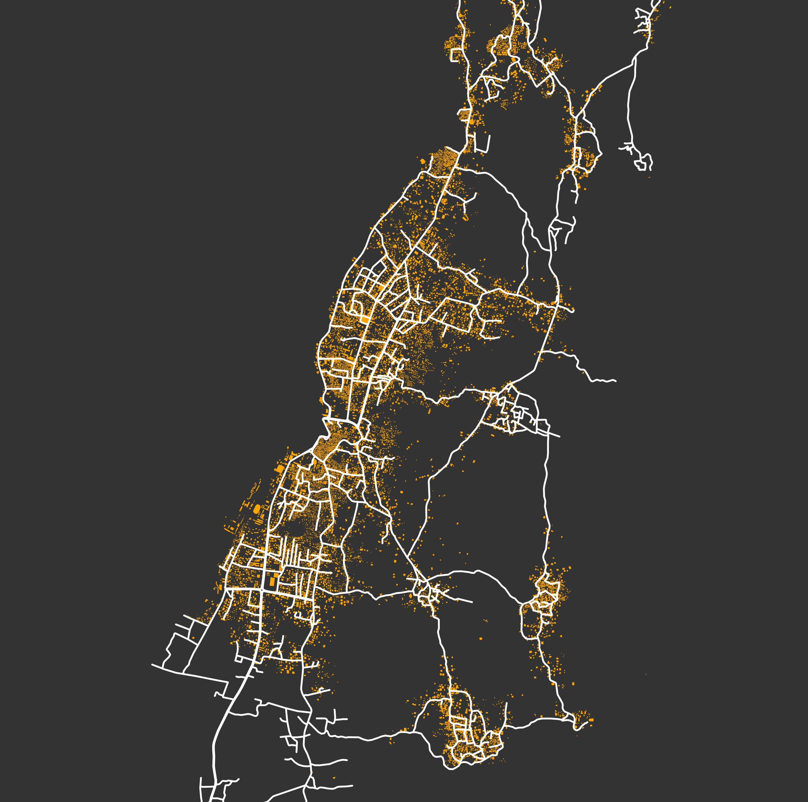

# Roads and Buildings SHP Parser

This script allows us to parse buildings and roads polygons from [Open Street Map](https://www.openstreetmap.org/#map=14/-11.7114/43.2587). It makes use of the [OSMnx](https://github.com/gboeing/osmnx) package to obtain these polygons, and export them into a local directory so that it can be used for further analysis.

<hr>

## Instructions

Install the [OSMnx](https://github.com/gboeing/osmnx)  package (the use of its [conda environment](https://anaconda.org/conda-forge/osmnx) is strongly suggested).

Run the *exportRoadAndBuildings.py* script to parse the shapefiles for a particular *lat-long* coordinate:

```shell
python exportRoadAndBuildings.py "PLACE_NAME" lat long dist
```
Where the "PLACE_NAME" is an arbitrary tag defined by the user to name the output files.

This will generate folders within the *SHP* path. These folders will contain the buildings and roads shapefiles for the requested location
(a preview of the area will also be exported to the *images* folder).

* SHP folder contains the [shapefiles](https://en.wikipedia.org/wiki/Shapefile) for buildings and roads
* NTW contains the network ([graphml](https://en.wikipedia.org/wiki/GraphML)) files for roads




## Examples

```shell
python exportRoadAndBuildings.py "YorkeysKnob" -16.8134 145.7168 1750
```

```shell
python exportRoadAndBuildings.py "Comoros" -11.7167 43.4296 1000
```

## Requirements

These scripts require [OSMnx](https://github.com/gboeing/osmnx) installed.

<hr>

## Authors

Héctor M. Sánchez C.
