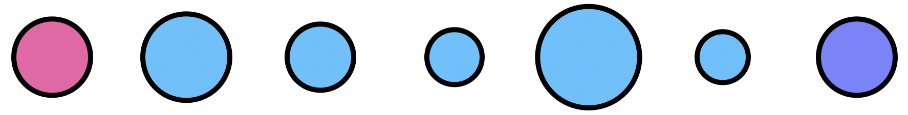

# Mosquito Population Size Heterogeneity Analysis

 

### Preliminary Exploration

To begin, we wrote a function to split up a population into groups with with a parameter (C) which allows you to dictate the amount of randomness present in the splitting.

The first graph below shows the results of splitting a population of size 10000 across 100 nodes with different values of the randomness parameter. The second graph shows the result of repeating this process 1000 times, and taking the median of those iterations.

However, we soon realized that, because we were using uniform randomness, on average, all the populations would be roughly the same. This phenomenon is especially true for larger populations and number of iterations, explaining what we see in the graphs above.

### Verification

To verify that mosquito population size heterogeneity actually has an impact on the spread of genes, we ran simulations on different linear population set ups*.

For example, when looking at a simulation with nodes with increasing population sizes versus one decreasing population sizes, we can see how the gene drive released at the initial node takes longer to spread throughout the nodes in the setup with increasing population size. This is due to the smaller number of mosquitos in the first node and its neighboring nodes.

Additionally, in the increasing population sizes system, we are able to see the actual release in the first node at the 50 day mark due to the small population size in the initial nodes.

Increasing population sizes:

Decreasing population sizes:

Currently, we are working on writing scripts to simulate different population setups given a total population size.

### Next Steps
Future exploration will involve examining the movement kernel, the probability distribution of a mosquito moving to a node a certain distance away, and its effects, in conjunction with heterogeneous population sizes.

### Authors

Maya Shen, Héctor M. Sánchez C.

*The different population setups are as follow: nodes with increasing, decreasing, increasing then decreasing, decreasing then increasing, and sporadic population sizes.
