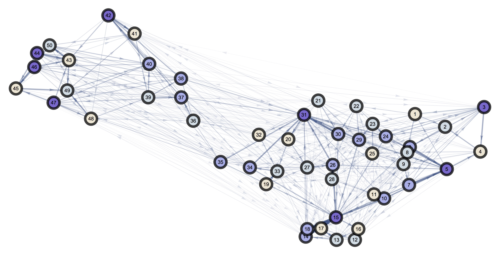
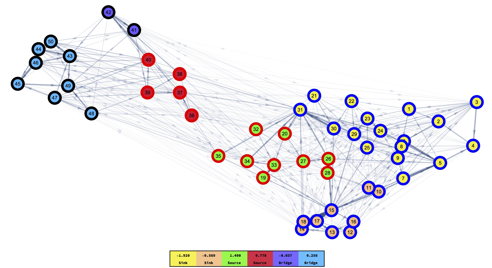

## Mosquito Sinks and Sources Detection

The idea of mosquito sinks and sources is important in the analysis of the transmission of mosquito-borne diseases. This is because the movement patterns of mosquitoes define how the pathogen traverses landscapes, and mosquitoes movement is defined by the availability of resources and environmental variables. This workflow focuses on answering the question of how to detect these sinks/sources and their relevance.

### Detecting Sink/Bridges/Sources

We start by laying out our landscape and clustering in a geographic way without taking into account the types of resources available at any location (colors being the detected clusters through hierarchical aggregation algorithms):

Now, to generate the mosquito-movement probabilities between the points in the landscape, we need to take into account the kind of resource available at each location (each color would be a different type of resource: sugar, blood, water, etc):

Given the information of the two separate networks we can detect sinks/bridges/sources in our landscape:

Sinks correspond to the clusters which mosquitoes enter more often than the exit, bridges represent the ones that mosquitoes enter/exit at a similar ratio, and sources the ones that mosquitoes get out of more often than they come into.

### Relevance

### Authors

Chris De León, Biyonka Liang, David L. Smith, Héctor M. Sánchez C.
