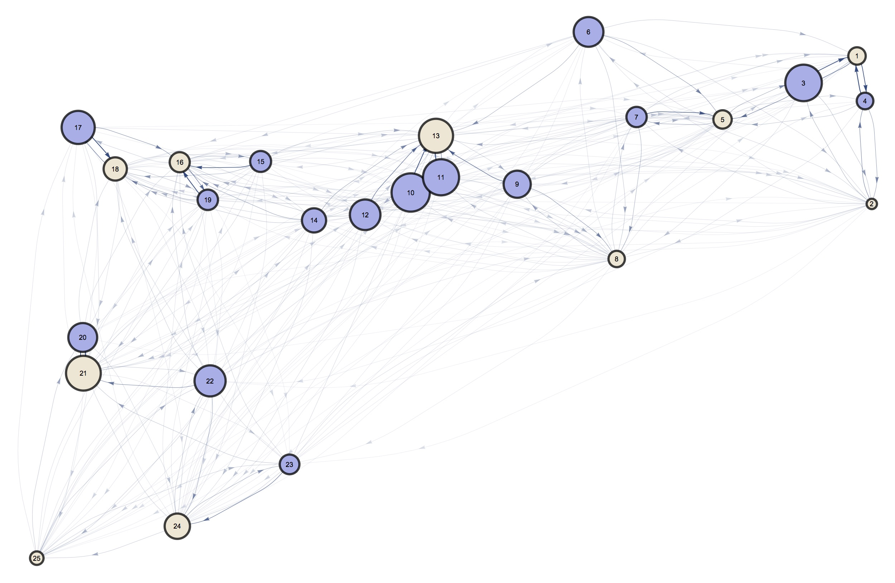

## Targeted Interventions

### Brief Description

As mentioned before, to make the most efficient use of our mosquito-control interventions, we need to make an analysis that takes into account not only the geographic distribution of households in the environment, but also the biological needs of the mosquitoes as they move through it.

To do so, we start by laying out our simulated landscape:

Once that is done, we can assign _n_ number of classes to simulate the different types of habitats. This can be done by defining an _n_-partite space for the network, where _n_ is the number of types of nodes, and the strength of the directionality defines the "partite-ness" of the connections (one a fully partite network and 0.5 equal to having each type of node being equally probable regardless of its class).

For this example, we will simulate two types of nodes (_n=2_) as shown in the figure that follows:

This results in an _n_-dimensional network in which mosquitoes move. If we think of mosquitoes as being simplified to random walkers in the network, we can reduce their movement to a Markov process in which their next step depends on their current location (assuming they have fulfilled their biological need). With this information, we can calculate the steady-state distribution of the nodes:

And, to visualize this better, we can rescale our network to highlight the nodes in which our random-walking mosquitoes spend more time (the ones to which they jump more often):

This is confirmed by running random walkers on top of our transitions network:

This analysis can be elevated to arbitrarily high dimensions of point types, and more flexible transition probabilities between classes (less partite-ness):

### Next Steps

The natural next step for this workflow would be to simulate mosquitoes on the network, and compare the death rates of applying in different random and targeted schemes.

### Authors

Héctor M. Sánchez C., Biyonka Liang, Sean L. Wu, Daniel Citron, David L. Smith
