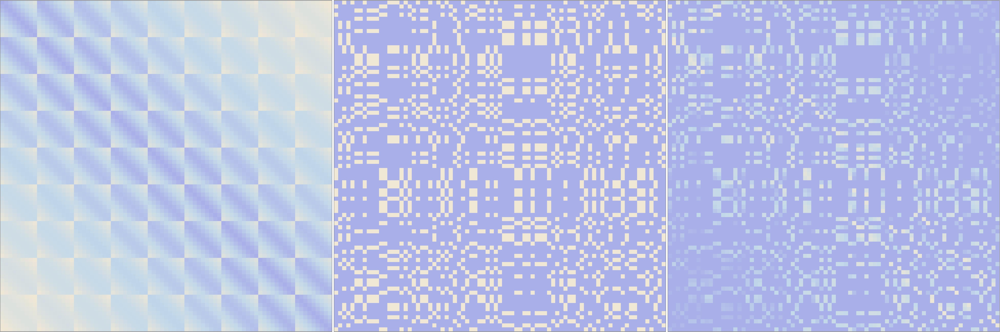
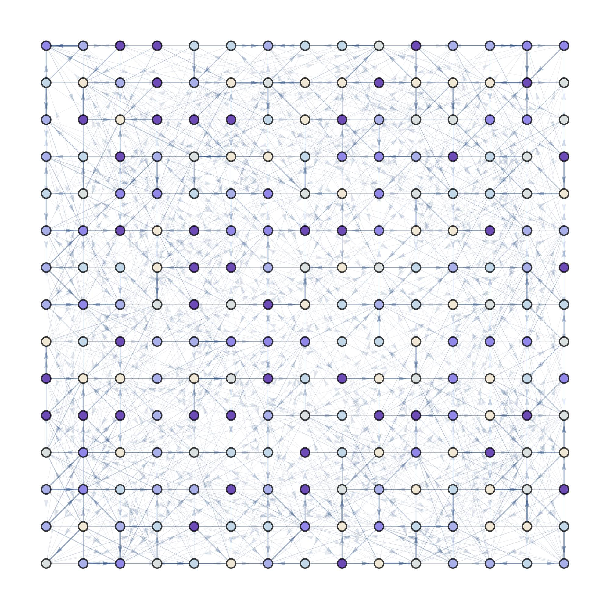
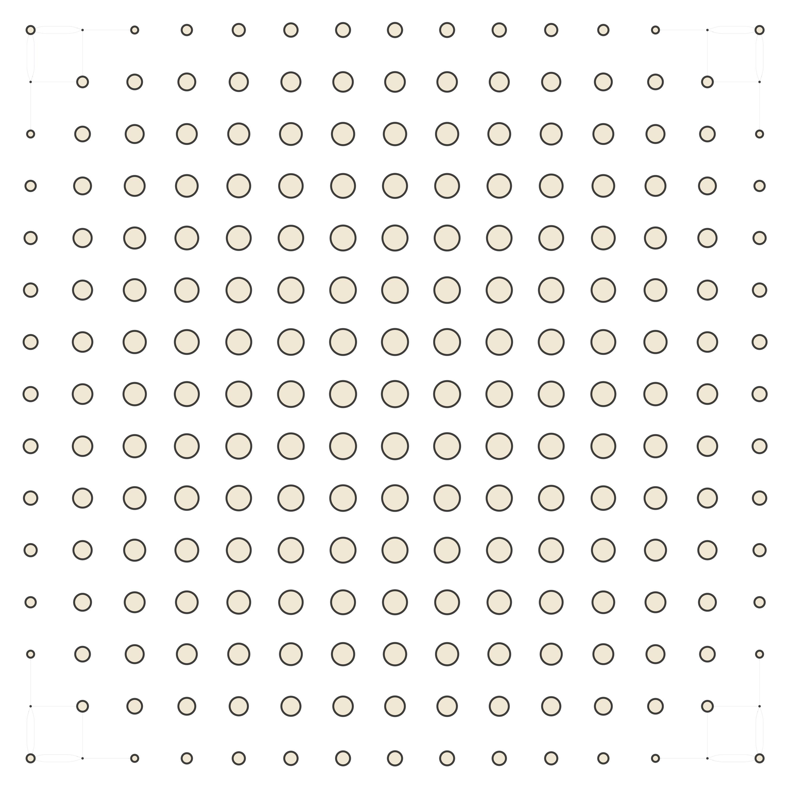
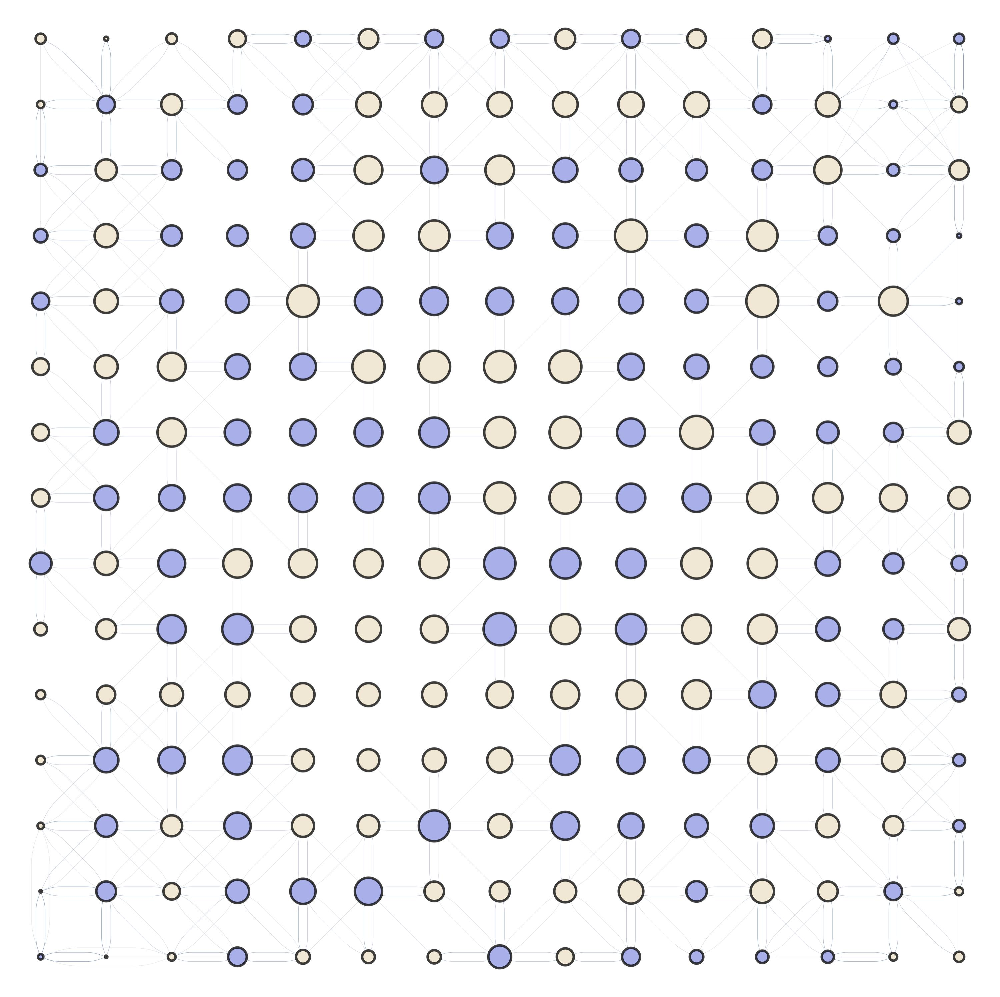
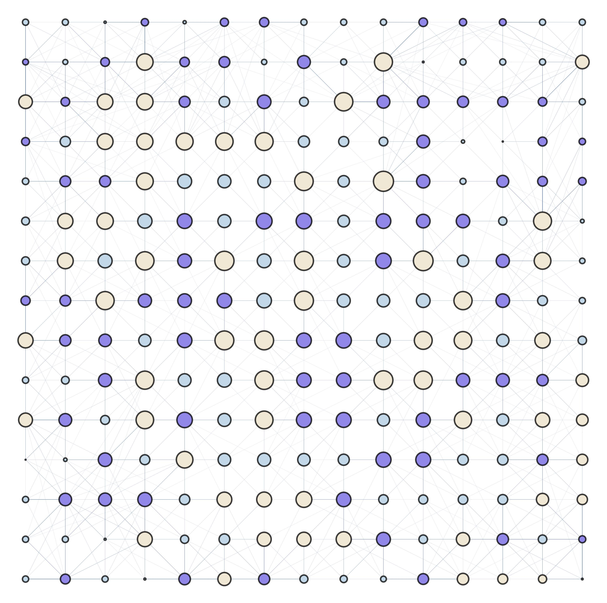
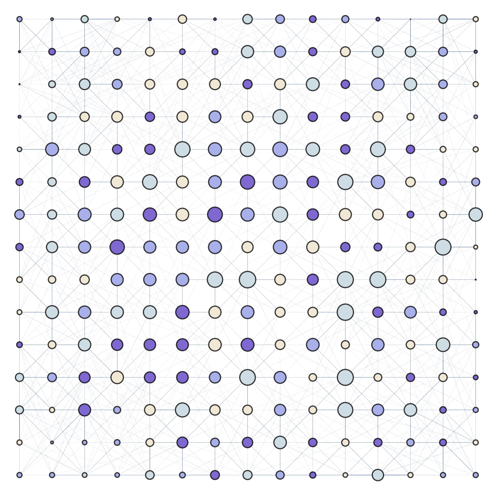
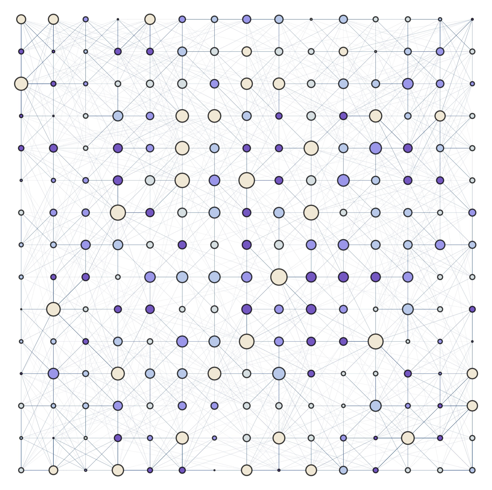
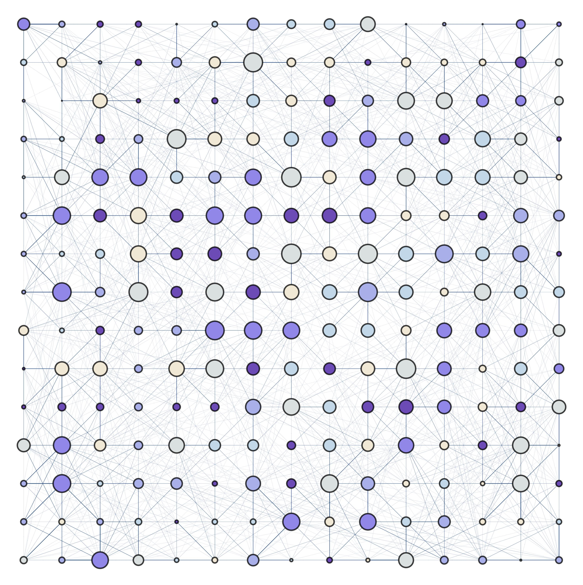
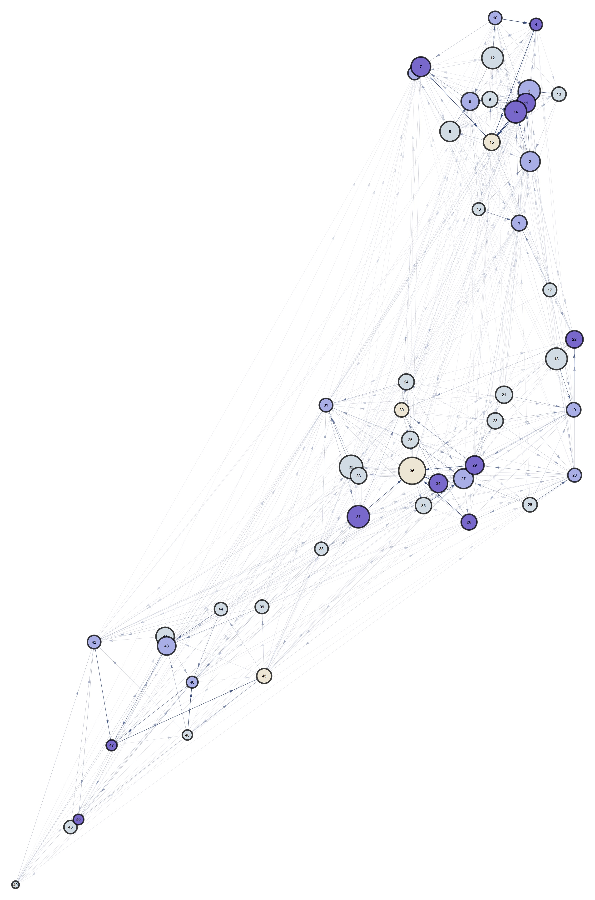

## The Walking Dead: Malaria Edition

As mentioned in the [targeted interventions thread](./TargetedInterventions.html), calculating the Markov Stationary Distribution on the mosquitos transitions in the movement network might provide valuable insight in terms of informing the importance of nodes in terms of mosquitos transit.

### Spatial Setting

Even though we could simulate mosquito movements in arbitrarily complex pointsets, it makes sense to start with a 2D regular lattice so that we are able to debug and analyze the effects of heterogeneity in mosquito movement patterns.

### Mosquito Movement Kernel

As a first approximation, we are using an extremely rough approximation of the mosquito probability of choosing a site based on the inverse of the Euclidean distance between sites. This, as we will see later, is not an accurate representation of the real phenomena, but will be improved in future iterations of the project.

### Network Partite-ness and Dimensionality

One of the critical parts of this workflow, is to add the heterogeneous selection of point-types by mosquito individuals based on their biological needs. To do this, we can add partite-ness to our transitions network. In a simple scenario, we can think of mosquitos as needing to meet the following requirements (in order): egg-laying, sugar feeding, blood feeding, resting. The distribution and

To visualize this more clearly, we can think of the following scenarios:

<ul>
  <li>1: Mosquitos can fulfill all their biological needs in any point.</li>
  <li>2: Mosquitos can lay eggs, and then they blood feed in two different sites.</li>
  <li>3: Mosquitos lay eggs, blood feed, and rest in three different point types.</li>
  <li>4: Mosquitos lay eggs, sugar feed, blood feed, and rest in four different point sets.</li>
</ul>

To generate these "n-partite" networks we follow the next process:

<ul>
  <li>Start with our uniform transitions matrix.</li>
  <li>Assign a point type to each node in the network (random uniform for now).</li>
  <li>Generate a "mask" matrix that penalizes transitions that are not allowed (or discouraged).</li>
  <li>Multiply the matrices and renormalize.</li>
</ul>

An example of this process can be visualized in the following figure, where the matrices show the movement probability, penalizations mask, and the renormalized-penalized movement matrix (in order):

In a purely theoretical sense, we can think about even more point types, and the algorithm to generate the n-partite network resulting from it. It is also worth noting that the penalties do not necessarily have to be binary, but can be continuous (generating a partially n-partite network).

An example of these movement matrices is given in the following figure, in which each color represents a type of site:

## Results

In a regular lattice, increasing the dimensionality of the network (in terms of point types), adds heterogeneity in the relative importance of the nodes. The following figures show the process of adding point types in a 13x13 grid of nodes. In the figures, each color represents a type of point, the nodes are scaled according to their Markov steady-state distribution (as described in: [targeted interventions](./TargetedInterventions.html))

## Future Work

The interaction of insecticide spraying and spatial repellents/attractors could pose an interesting computational problem. This is because, as we introduce heterogeneity (both in terms of the dimensions of the partite network, and their distribution in the landscape), it becomes more difficult to predict the pathways mosquitos will follow. If we imagine mosquitos as flowing elements in the environment to fulfill their biological needs, we can see that their movements might become more complex as we increase restrictions on the spots they are allowed to move into. This effect might have significant impact in the effectiveness of vector-control interventions.

## Files

* [https://github.com/Chipdelmal/MoNeT/tree/master/Dev/HectorSanchez/WalkingDead](https://github.com/Chipdelmal/MoNeT/tree/master/Dev/HectorSanchez/WalkingDead)

## Authors

Héctor M. Sánchez C.
