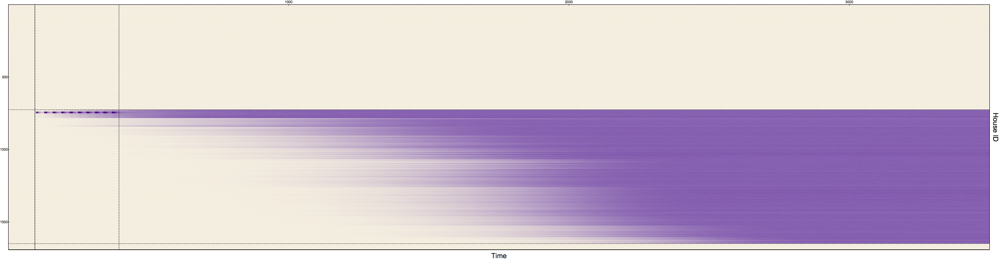

## Yorkeys Knob: Homing Drive & _Wolbachia_  Simulations

One of the questions we are interested in answering in terms of gene-drives, is the capability these constructs have in spreading across spatial landscapes. Taking the tests of the [*MGDrivE*](https://chipdelmal.github.io/MGDrivE/) framework to the next step of realism, we chose to run a simulation of releases  in Yorkeys Knob with _Aedes aegypti_ being the mosquito species present in the area.

  

### Purpose

The main purpose of this test was to continue our tests upon our framework in larger, more complex, landscapes. On top of this, we wanted to test our ability to run our model in both our lab's server, and the [TACC](https://www.tacc.utexas.edu/) cluster.

### Results

#### Homing drive

In this test, we released a homing drive in the environment. The releases scheme used was: 
- Releases Number: 10 
- Releases Interval: 30 days 
- Release Size:  
- Release Cluster: Yorkeys Knob
 

The aggregated population dynamics can be summarized by the following plot:
 

  

In which we can see that the homing drive (_H_) did get fixated in the part of the population, but not in all of it. A fraction of the mosquito population remained as wild-type (_W_). To understand why this happened, we have to look at how the drive spread spatio-temporally across the landscape:

  

In this plot, the _x-axis_ represents time, while the _y-axis_ represents the house's ID number. Colors are mapped to the total amount of mosquitos with a given genotype present in each location. Houses are grouped together according to the spatial clustering shown in the first figure of this document (horizontal dashed lines delimit the COLOR_A,B,C areas). Horizontal dashed lines denote the beginning and end of the drive's releases.

Through close examination, we can see that our homing drive did spread in the geographical cluster in which we released it, and that it stayed confined within that cluster. We can also get a sense of the speed at which it spread by looking how each "row" in our plot becomes more "purple", which indicates the presence of our homing construct.

 

  

#### _Wolbachia_

_Wolbachia_ releases have already been tested in the field, so it makes sense for us to use it as a base-case in testing our model. For this test, we used the following releases scheme:
- Releases Number: 10 
- Releases Interval: 14 days 
- Release Size:  
- Release Cluster: Trinity Park
 

Again, we can analyse the results of the aggregate population in our allele frequencies counts plot:
 

  

And analyze its spread in the spatio-temporal presence plot:
 

  

In this case, we achieved fixation in our target cluster much quicker. This is due to both, an increase in the number of releases, and the fact that we released in many locations at the same time (as opposed to releasing in just one house).

### Conclusions and Limitations

This test allowed us to move one step closer to more comprehensive and realistic tests. Both "drives" behaved as expected, and the use of the server/cluster will greatly enhance our capabilities in terms of running larger-scale scenarios.

The main limitation to overcome in the short-term, is the low rate of long-distance migration; which biases our results in favor of gene-drives confinability as opposed to spillovers.

#### Authors

Jared Bennett\*, Héctor M. Sánchez C.\*, Sean L. Wu, John M. Marshall
