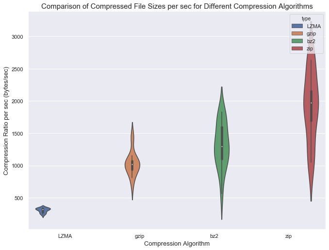

# Experiments Compression and Serialization

To decide which Compression algorithm would be best for our use, we ran a benchmark to compare them.
We want a compression algorithm that is lossless and is easily utilized in Python.
This criteria led us to consider the following compression algorithms: zip, lzma, gzip and bz2.

Here are the steps to the following experiment:
1. Load in the data from the appropriate directory
2. Clean the data to ensure data is consistent & usable
3. Convert cleaned data into a dictionary where it follows this format: {header : array of column values}
4. For each compression algorithm we will complete the following steps
  - Start a timer.
  - Pickle and compress the data.
  - Record the time. (Note: For the Zip compression algorithm, we skipped this step)
  - Open output directory & write compressed data into the appropriate (.zip, .xz, .gz, .gz2).
  - Record the time.

After collecting this data, we generated the following plots to assist us with our analysis.

<h3>Conclusion: </h3>

After our analysis, we decided to proceed forward with the bz2 compression algorithm.

Here was our thought process:
- Looking at the final compression ratios, it was clear that lzma & bz2 gave the best compression ratios.
- bz2 was chosen over lzma because our experiments showed that bz2's compression time was faster than lzma's.

Notes on the experiment:
- This experiment was conducted using 17 csv files, each ranged from 126KB - 132KB
- Code for this experiment can be found here:
https://github.com/Chipdelmal/MoNeT/blob/master/Dev/PriscillaZhang/Compression.py

## Authors

Priscilla Zhang, Héctor M. Sánchez C.
