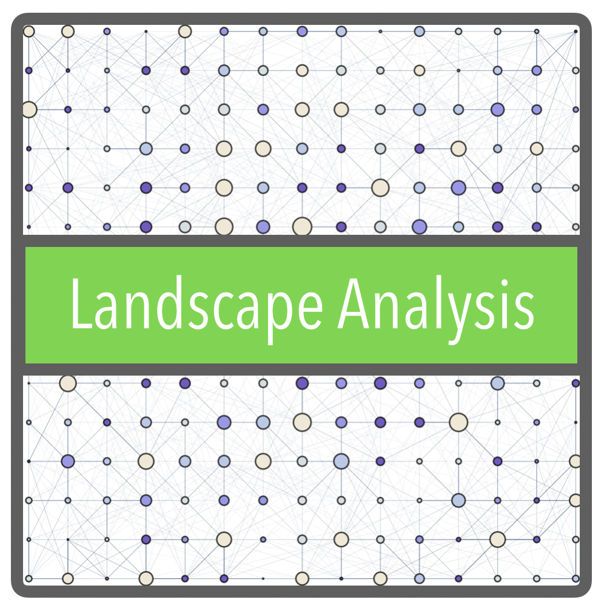
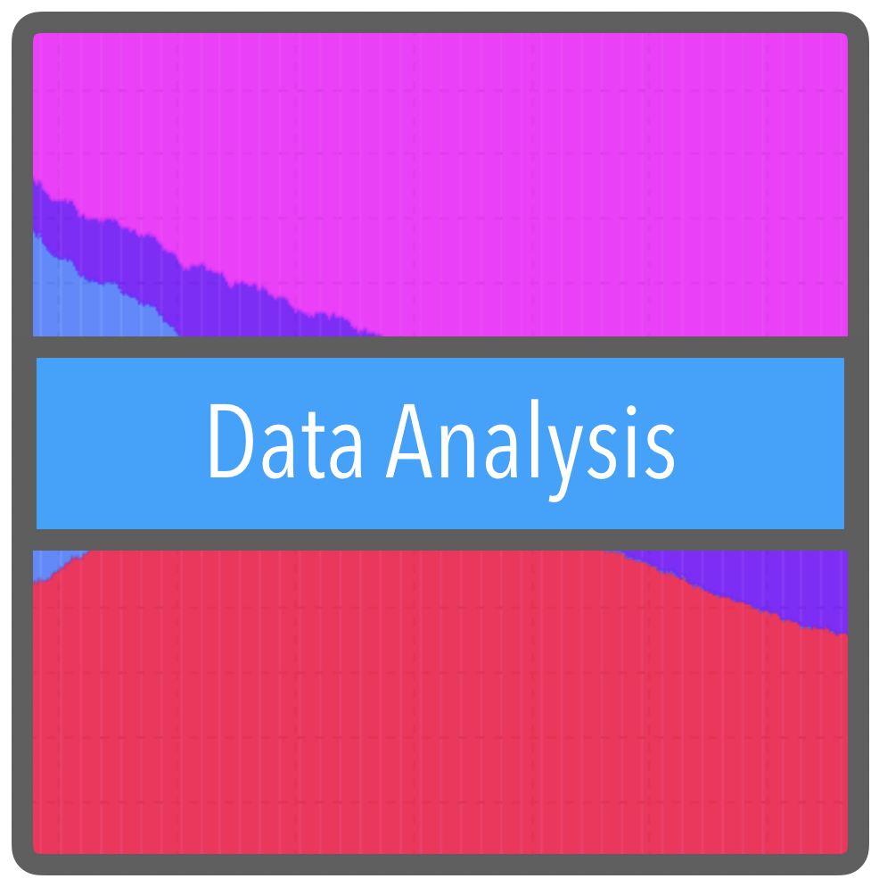
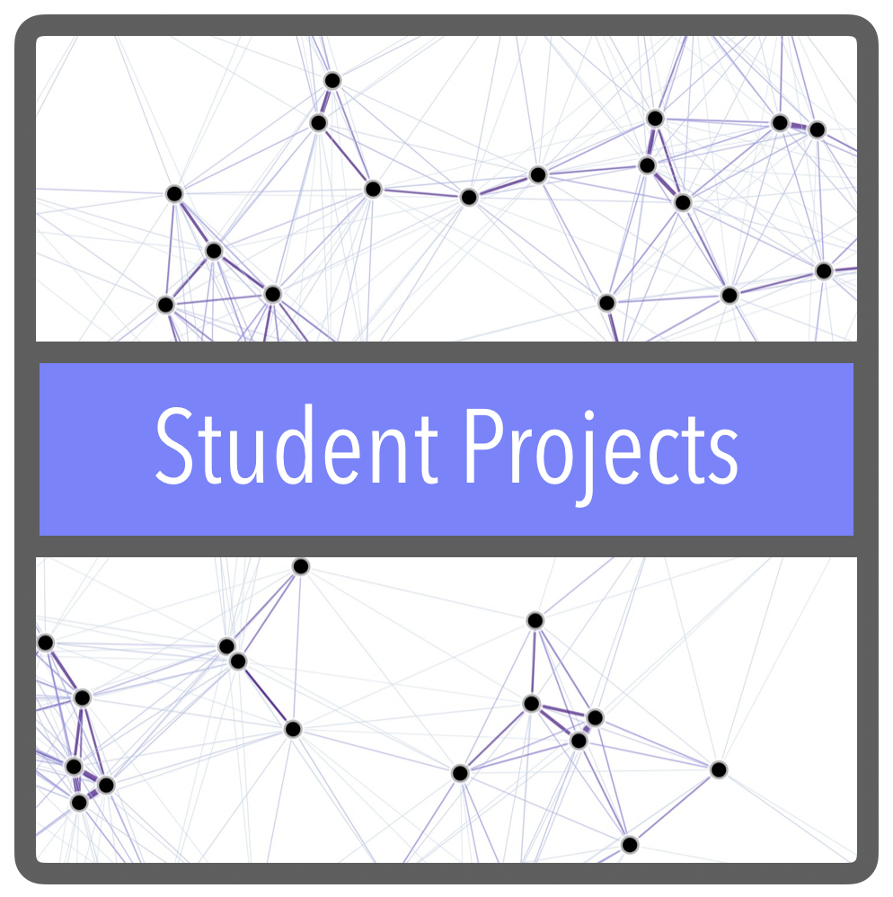

This project was born to facilitate collaboration in network analysis routines useful for both [*MGDrivE*](https://marshalllab.github.io/MGDrivE/) (__University of California, Berkeley__) and [*MASH*](https://smitdave.github.io/MASH-Main/) (__IHME__) projects. Its main objective at that point was to create a set of tools that allow us to study landscapes in a way that is relevant in terms of mosquito-borne diseases. After some consideration, however, the scope of the project was extended to the development of computational tools to understand understand diseases transmitted by mosquitos. Under this new scope, a new collaboration was born with __Tecnológico de Monterrey__ to develop computer science student projects to aid the study of spatial processes related to mosquito movement.

We are doing this by separating our tasks into three categories:
* __Landscape Analysis:__ These activities revolve around studying the landscape as a part of genes and diseases transmission. Namely, how does the spatial distribution and movement of humands and mosquitoes affect the patterns of genes and bites flows.
* __Data Analysis:__ This is a "support" set of tasks aimed at providing the toolkits necessary to analyse outputs from [*MGDrivE*](https://marshalllab.github.io/MGDrivE/) and [*MASH*](https://smitdave.github.io/MASH-Main/). As such, it involves the development of computationally intensive data analysis and data visualization techniques.
* __Undergraduate Student Projects:__ These projects are aimed at CS and engineering students (in collaboration with faculty at the "Tecnológico de Monterrey" Institute in México) who want to participate in semester-long development of applications to help bring further our understanding of mosquito-borne diseases transmission.

Click on each on the corresponding images to learn more about our projects:

  

# Authors

  <b>Lead:</b> <a href="https://chipdelmal.github.io/">Héctor M. Sánchez C.</a> [UCB] 
  <b>Dev:</b> Sarafina Smith  [UCB], <a href="https://www.linkedin.com/in/biyonkaliang">Biyonka Liang</a> [UCB], Gillian Chu [UCB], Maya Shen [UCB]<!--, Victor Ferman [UCB]--> 
  <b>Former dev:</b> Sabrina Wong [UCB] 
  <b>Participant Students:</b> Moisés Montaño Copca [ITESM] 
  <b>Former participant students:</b> Martín Alejandro Molinero Morales [ITESM], Christian Ricardo Solís Cortés [ITESM], Salomón Olivera Abud [ITESM], Esteban Quintana Cueto [ITESM] 
  <b>Collaborators:</b> <a href="https://www.researchgate.net/profile/Benjamin_Valdes">Benjamín Valdés</a> [ITESM], András Takacs  [ITESM]<!--, <a href="https://www.researchgate.net/profile/Edgar_Vallejo">Edgar E. Vallejo</a> [ITESM]--> 
  <b>PI's:</b> <a href="http://sph.berkeley.edu/john-marshall">John M. Marshall</a> [UCB] and <a href="http://www.healthdata.org/about/david-smith">David L. Smith</a> [IHME]

  
