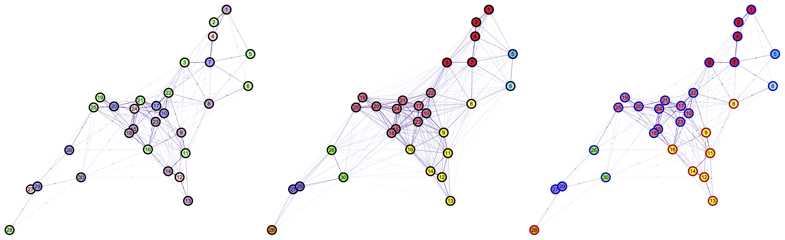

# Mosquito Networks Taskforce

This repository was created to facilitate collaboration in network analysis routines useful for both *MGDrivE* and *MASH* projects. Its main objective is to create a set of tools that allow us to study landscapes in a way that is relevant in terms of mosquito-borne diseases.

## Description

Mosquito movement across landscapes can be approximately modeled by transition probabilities that are defined by the distances between resources points in a spatial plane. This is because mosquitoes move from point to point in search of resources and to fulfill biological needs. Taking this into account, it makes sense to think of this landscape as a network of resources, where the mosquito movement is directed between sites.

## Workflows

The broad-scope of the project has been divided into several workflows that follow the over-arching theme of analyzing mosquito movement in geographic point sets.

<h3> [Mosquito Sinks and Sources Detection](./SinkSource.html) </h3>

Mosquito-flow in the landscape is defined by the biological needs of the insects and the availability of resources (in a simple scenario). In certain situations, these variables might generate structures where mosquitos flows are highly directional between geographical clusters. This workflow was created to investigate which properties of the landscapes give birth to these kind of dynamics.

### [Clustering of Directed Networks with Geographical Constraints](./Community.html)

Targeted vector control interventions are usually applied on the field without taking into account the movement of mosquitos across the landscape. This, however, might not be the most optimal way of trying to eradicate these insects. In this workflow, we try to create and test a clustering algorithm that takes into account both: mosquito movement, and geographical constraints; to understand the factors that would promote more efficient mosquito-control campaigns.

<!--Authors: Biyonka Liang, Héctor M. Sánchez C., Sean L. Wu, Daniel Citron, John M. Marshall, David L. Smith-->
### [Centrality Analysis of Landscapes](./Centrality.html)

The study of gene-drives' spread in realistic landscapes is of upmost importance when we think of using them to eradicate mosquito-borne diseases. Given that the insects' movements are the driving force behind these genes' spread, studying the flow of these individuals in geographic settings becomes crucial. In this workflow we borrow the centrality analysis of networks to understand the nodes that are more relevant in terms of these patterns, so that we can use this information to design studies that allow us to confine our constructs to designated areas.

### Road-Flight Path Intersections

<i>Aedes aegypti</i>  mosquitos avoid flying over roads; which, in turn, modifies the expected movement flows on the landscape. We would like to study how this specific variable affects the broad-scale dynamics of mosquito movement to understand the effects this would have in diseases transmission; but for now this is still an open line to be tackled.

## Auxiliary Scripts and Libraries

### [OSMnx Parser](./OSMnx.html)

A script to parse and export SHP files from buildings roads polygons from [Open Street Map](https://www.openstreetmap.org/#map=14/-11.7114/43.2587) using [OSMnx](https://github.com/gboeing/osmnx).

### [Python Module](./PythonModule.html)

A compilation of the functions created as part of the project.

### [Conda Environment](./CondaEnvironment.html)

The environment that contains all the packages required to run our routines.

## Authors

<a href="https://chipdelmal.github.io/">Héctor M. Sánchez C.</a>, <a href="https://slwu89.github.io/">Sean L. Wu</a>, Biyonka Liang, Sarafina Smith, Sabrina Wong 

## PI's

John M. Marshall and David L. Smith
