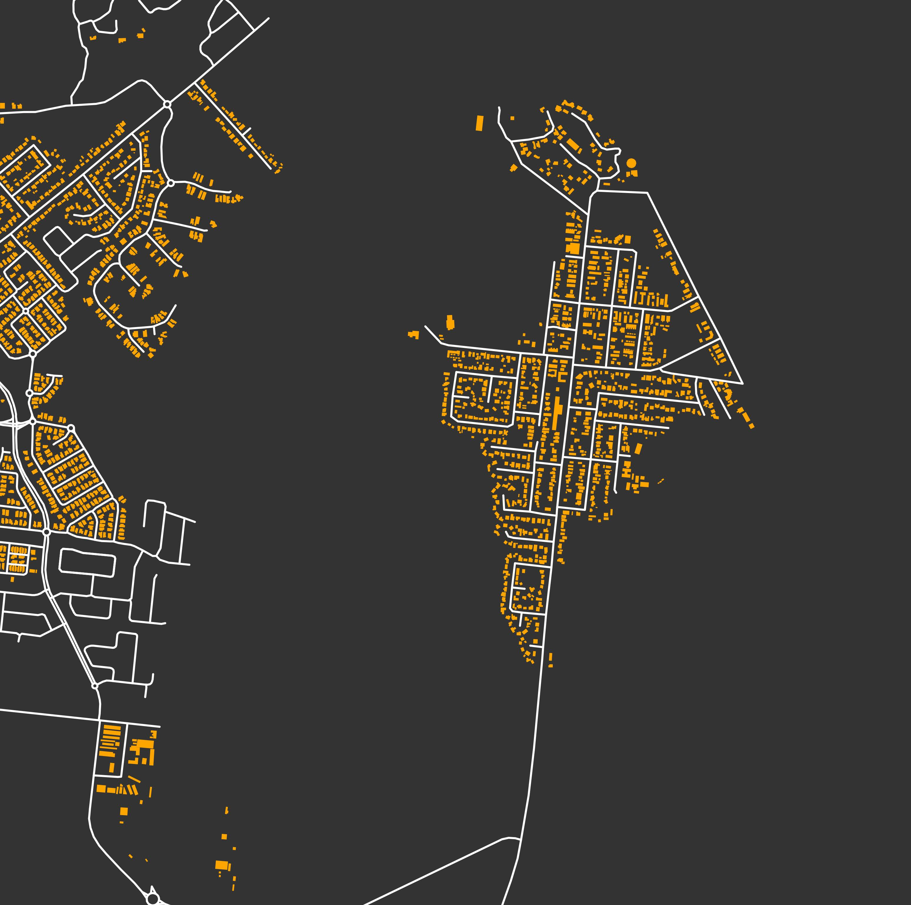

<i>This project was born to facilitate collaboration in network analysis routines useful for both [*MGDrivE*](https://chipdelmal.github.io/MGDrivE/) and [*MASH*](https://smitdave.github.io/MASH-Main/) projects. Its main objective is to create a set of tools that allow us to study landscapes in a way that is relevant in terms of mosquito-borne diseases.</i>

SITE UNDER CONSTRUCTION

# Description

Mosquito movement across landscapes can be approximately modeled by transition probabilities that are defined by the distances between resources points in a spatial plane. This is because mosquitoes move from point to point in search of resources and to fulfill biological needs. Taking this into account, it makes sense to think of this landscape as a network of resources, where the mosquito movement is directed between sites...

# Workflows

The broad-scope of the project has been divided into several workflows that follow the over-arching theme of analyzing mosquito movement in geographic point sets.
Click on the titles for more information.

## [Mosquito Sinks and Sources Detection](./SinkSource.html)

Mosquito-flow in the landscape is defined by the biological needs of the insects and the availability of resources (in a simple scenario). In certain situations, these variables might generate structures where mosquitos flows are highly directional between geographical clusters. This workflow was created to investigate which properties of the landscapes give birth to these kind of dynamics.

## [Targeted Interventions](./TargetedInterventions.html) and [Regular Grid Markov Analysis](./TheWalkingDead.html)

Identifying the most important points in landscapes in terms of mosquito-control interventions' effectiveness is far from a trivial task. These individuals move in probabilistic patterns according to their intrinsic biological needs, and environmental factors. To maximize the effect of the deployed measures to kill them, we need to take into account these variables, and this is what this workflow is all about.

## [Centrality Analysis of Landscapes](./Centrality.html)

The study of gene-drives' spread in realistic landscapes is of upmost importance when we think of using them to eradicate mosquito-borne diseases. Given that the insects' movements are the driving force behind these genes' spread, studying the flow of these individuals in geographic settings becomes crucial. In this workflow we borrow the centrality analysis of networks to understand the nodes that are more relevant in terms of these patterns, so that we can use this information to design studies that allow us to confine our constructs to designated areas.

## [Households Distances Analysis](./HouseholdDistances.html)

The distance between households is thought to be an important metric in terms of the analysis of mosquito populations mixing and gene-drive flow. This is particularly true in the case of the _Aedes aegypti_ species, which is know for being a weak flyer that lives in close vicinity to human houses. This auxiliary workflow is aimed towards calculating the distances between the centroids of the households so that we can characterize the impact of these distances in terms of gene-flows.

## [Potentially Useful Network Metrics](./NetworkMetrics.html)

This document contains some of the notes we have compiled on the networks metrics that could provide some insights of how mosquito movement shapes the transmission of both: diseases and gene drives. This is mainly a brainstorming space for ideas to be shared and discussed.

## [Clustering of Directed Networks with Geographical Constraints](./Community.html)

Targeted vector control interventions are usually applied on the field without taking into account the movement of mosquitos across the landscape. This, however, might not be the most optimal way of trying to eradicate these insects. In this workflow, we try to create and test a clustering algorithm that takes into account both: mosquito movement, and geographical constraints; to understand the factors that would promote more efficient mosquito-control campaigns.

## [Pointsets Generation](./Pointsets.html)

Even though we can parse real-world landscapes from OpenStreet Map, generating random points distributions is still useful in terms of theoretical questions about how these distributions affect the metrics and results of our analyses.

## Road-Flight Path Intersections

<i>Aedes aegypti</i>  mosquitos avoid flying over roads; which, in turn, modifies the expected movement flows on the landscape. We would like to study how this specific variable affects the broad-scale dynamics of mosquito movement to understand the effects this would have in diseases transmission; but for now this is still an open line to be tackled.

# Auxiliary Scripts and Libraries

These routines were created as standalone functions to support the main research questions asked in the project.

* [Python Module](./PythonModule.html): A compilation of the functions created as part of the project.
* [Conda Environment](./CondaEnvironment.html): The environment that contains all the packages required to run our routines.
* [OSMnx Parser](./OSMnx.html): A script to parse and export SHP files from buildings roads polygons from [Open Street Map](https://www.openstreetmap.org/#map=14/-11.7114/43.2587) using [OSMnx](https://github.com/gboeing/osmnx).
* [Fancy Maps Parser](./FancyMaps.html): A _Mathematica_ script that parses maps from _Wolfram Database_, exports the coordinates, populations, and a "fancy" map.

# Authors

* Lead: <a href="https://chipdelmal.github.io/">Héctor M. Sánchez C.</a> 
* Dev: Biyonka Liang, <a href="https://slwu89.github.io/">Sean L. Wu</a>, Sarafina Smith, Sabrina Wong, Daniel Citron 
* PI's: [John M. Marshall](http://sph.berkeley.edu/john-marshall) and [David L. Smith](http://www.healthdata.org/about/david-smith)

 

