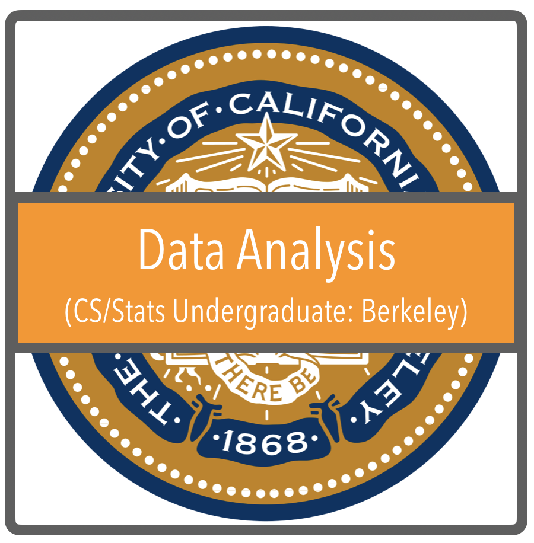
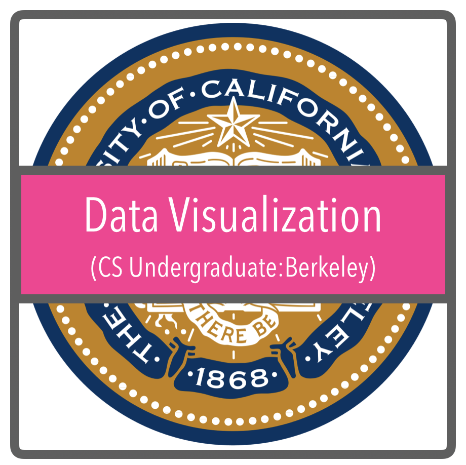

This project was born to facilitate collaboration in network analysis routines useful for both [*MGDrivE*](https://marshalllab.github.io/MGDrivE/) (__University of California, Berkeley__) and [*MASH*](https://smitdave.github.io/MASH-Main/) (__IHME__) projects. Its main objective at that point was to create a set of tools that allow us to study landscapes in a way that is relevant in terms of mosquito-borne diseases. After some consideration, however, the scope of the project was extended to the development of computational tools to understand understand diseases transmitted by mosquitos. Under this new scope, a new collaboration was born with __Tecnológico de Monterrey__ to develop computer science student projects to aid the study of spatial processes related to mosquito movement.

We are doing this by separating our tasks into four main categories:

  <!---->

* <a href="./Berkeley.html">__Data Analysis:__</a> The core of our gene-drive related projects. These lines of research deal with the analyses of the landscapes, how mosquitos move in search for resources, and how this affects the way genes spread across geographical settings.
* <a href="./MachineLearning.html">__Machine Learning/Network Theory:__</a> These projects have been developed in collaboration with people from _Tecnológico de Monterrey_ to incorporate more CS techniques into the prediction and study of the spread of mosquito-borne diseases.
* <a href="./ITESM.html">__Software Development:__</a> Another set of projects in collaboration with _Tecnológico de Monterrey_ in the development of software applications that could help in the deployment of solutions for field and health-oriented individuals (non-programmers/mathematicians).
* <a href="./DataVizQro.html">__Data Visualization:__</a> Most of our applications require communicating extremely complex sets of data to people from diverse backgrounds, as such, we devote a lot of our time into coming up with attractive, informative ways to display our results.

Click on each on the corresponding images to learn more about our projects!

# Authors

  <b>Lead:</b> <a href="https://chipdelmal.github.io/">Héctor M. Sánchez C.</a> [UCB] 
  <b>Active Dev/Research</b>: Gillian Chu [UCB], Maya Shen [UCB], Yunwen Ji [McGill], Marco Luna [ITESM] 
  <b>Former Dev/Research:</b> Victor Ferman [UCB], Sarafina Smith  [UCB], <a href="https://www.linkedin.com/in/biyonkaliang">Biyonka Liang</a> [UCB], Sabrina Wong [UCB] 
  <b>Former participant students: </b> Martín Alejandro Molinero Morales [ITESM], Christian Ricardo Solís Cortés [ITESM], Salomón Olivera Abud [ITESM], Esteban Quintana Cueto [ITESM], Moisés Montaño Copca [ITESM] 
  <b>Collaborators:</b> <a href="https://www.researchgate.net/profile/Benjamin_Valdes">Benjamín Valdés</a> [ITESM], András Takacs  [ITESM] 
  <b>PI's:</b> <a href="http://sph.berkeley.edu/john-marshall">John M. Marshall</a> [UCB] and <a href="http://www.healthdata.org/about/david-smith">David L. Smith</a> [IHME]

